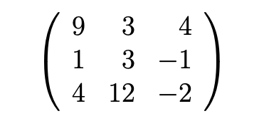

```{r setup, include=FALSE}
knitr::opts_chunk$set(echo = TRUE)
```

2. Dado x = (3,−5,31,−1,−9,10,0,18) y dado y = (1,1,−3,1,−99,−10,10,−7) realice lo siguiente:

Introduzca x y y como vectores en R.

```{r}
x <- c(3,-5,31,-1,-9,10,0,18)
y <- c(1,1,-3,1,-99,-10,10,-7)
```

Calcule la media, la varianza, la raíz cuadrada y la desviación estándar de y.

```{r}
mean(y)
var(y)
sqrt(abs(y))
sd(y)
```

Calcule la media, la varianza, la ra ́ız cuadrada y la desviacio ́n esta ́ndar de x.

```{r}
mean(x)
var(x)
sqrt(abs(x))
sd(x)
```


Calcule la correlaci ́on entre x y y.

```{r}
cor(x,y)
```

Escriba un comando en R para extraer las entradas 2 a la 7 de x.

```{r}

x[2:7]
```

Escriba un comando en R para extraer las entradas de y excepto la 2 y la 7.
```{r}
y[-c(2,7)]
```

Escriba un comando en R para extraer las entradas de y menores a -3 o mayores a 10.
```{r}
y[ 10 < y | y < -3 ]
```

Escriba un comando en R para extraer las entradas de x mayores a 0 y que sean nu ́meros pares.

```{r}
x[x%%2 == 0 & x > 0]
```

3. Introduzca en R la siguiente matriz a 4 × 3 usando:
A = matrix(c(1,2,3,4,5,6,7,8,9,10,11,12),nrow=4,"byrow"="true")
Luego, obtenga algunos elementos de la matriz de la siguiente manera: A[1,1:3], A[1:4,2], A[3,3], A[11], A[20], A[5,4], A[1,1,1] y explique qu ́e pasa en cada caso.

```{r, eval= FALSE}
A = matrix(c(1,2,3,4,5,6,7,8,9,10,11,12),nrow=4,"byrow"="true")

A[1,1:3] #muestra los primeros tres elementos de la fila uno
 
A[1:4,2] #de las cuatro filas muestra el segundo elemento

A[3,3] # elemento de la tercer fila y tercer columna

A[11] #el undecimo elemento contando de arriba hacia abajo

A[20] #el vigésimo elemento no existe en la tabla

A[5,4] #elemento de la quinta fila y cuarta columna no existe

A[1,1,1] #el tercer indice está de más
```

4. Investigue para qu ́e sirven los comandos de R as.matrix(...) y as.data.frame(...), expli- que y d ́e un ejemplo de cada uno.

as.matrix() cambiar el argumento ingresado en una matriz
```{r}
as.matrix(x)
```

as.data.frame() cambia el argumento a dataframe.

```{r}
as.data.frame(y)
```

5. Introduzca usando código R (no archivos) en un DataFrame la siguiente tabla de datos:

```{r,echo=FALSE}
knitr::include_graphics("Captura de Pantalla 2020-08-11 a la(s) 13.50.09.png")

data.frame(Peso = c(76,67,55,57,87,48),
           Edad = c(25,23,19,18,57,13),
           Nivel_Educativo  = factor(x = c("Lic","Bach","Bach","Bach","Dr","MSc"),
                                     levels = c("Bach","Lic","MSc","Dr")))
```
6. En muchas ocasiones nos interesa hacer referencia a determinadas partes o componentes de un vector. Defina el vector x = (2, −5, 4, 6, −2, 8), luego a partir de este vector defina instrucciones en R para generar los siguientes vectores:

- y = (2, 4, 6, 8), así definido y es el vector formado por las componentes positivas de x.
```{r}
x <- c(2, -5, 4, 6, -2, 8)
y <- x[x>0]

y
```

- z = (−5, −2), así definido z es el vector formado por las componentes negativas de x.
```{r}
z <- x[x<0]
z
```

- v = (−5, 4, 6, −2, 8), así definido v es el vector x eliminada la primera componente.
```{r}
v <- x[-1]
v  

```

w = (2, 4, −2). así definido w es el vector x tomando las componentes impares.
```{r}

w <- x[c(T,F)]

w
```

7. Queremos representar gráficamente la funci ́on coseno en el intervalo [0, 2π]. Para esto creamos el vector x de la siguiente forma x<-seq(0,2*pi,length=100). ¿Cu ́al es la diferencia entre las gra ́ficas obtenidas por comandos plot?


En el primer gráfico el eje x y el color no es especifican por lo que toman valores predeterminados, en el segundo gráfico la escala del eje x es x y su color es rojo.
```{r}

x<-seq(0,2*pi,length=100) 
plot(cos(x)) 
plot(x,cos(x),col="red")
```

8. Para tabla de Datos que viene en el archivo DJTable.csv el cual contiene los valores de las acciones de las principales empresas de Estados Unidos en el an ̃o 2010, usando el comando plot de R, grafique (en un mismo gra ́fico) las series de valores de las acciones de las empresas CSCO (Cisco), IBM, INTC (Intel) y MSFT (Microsoft).

```{r}
library(readr)
library(lubridate)
library(dplyr)

DJTable <- read_delim("DatosTarea1/DJTable.csv", 
    ";", escape_double = FALSE, trim_ws = TRUE)

names(DJTable)[1] <- "FECHA"

DJTable <- DJTable %>%
  mutate(FECHA = as.Date(FECHA,"%d/%m/%Y"))

str(DJTable)

plot(x = DJTable$FECHA, y = DJTable$CSCO,type = "l",col = "red", 
   main = "Stock chart", ylab = "", xlab = "", ylim = c(0,250))
lines(x= DJTable$FECHA, y= DJTable$IBM, type = "l", col = "green")
lines(x = DJTable$FECHA, y= DJTable$INTC, type = "l", col = "blue")
lines(x= DJTable$FECHA, y = DJTable$MSFT, type = "l", col = "purple")
legend("topright", c("IBM","MSFT","CSCO","INTC"), fill = c("red","green","blue","purple"), title = "Empresas: ")
```

9. Repita el ejercicio anterior usando funciones del paquete ggplot2.
```{r}
library(ggplot2)

DJTable %>%
  ggplot(mapping = aes(x= FECHA)) +
  geom_line(mapping = aes(y= CSCO, color = "CSCO"))+
  geom_line(mapping= aes(y=IBM, color = "IBM")) +
  geom_line(mapping =  aes(y=INTC, color = "INTC"))+
  geom_line(mapping =  aes(y = MSFT, color = "MSFT"))+
  labs(x = "", y = "", title = "STOCK CHART")+
  theme_minimal()


              
```
 
 10. Cargue en un DataFrame el archivo EjemploAlgoritmosRecomendacion.csv y haga lo siguiente:
 
 
Calcule la dimensión de la Tabla de Datos.
```{r}
Datos <- read.table("DatosTarea1/EjemploAlgoritmosRecomendacion.csv",
                    header=TRUE, sep=";",dec=",",row.names=1)

dim(Datos)
```

Despliegue las primeras 2 columnas de la tabla de datos.

```{r}
Datos[,1:2]
```
 
Ejecute un “summary” y un “str” de los datos.

```{r}
summary(Datos)
str(Datos)
```

Calcule la Media y la Desviación Estándar para todas las variables cualesquiera. 

```{r}
lapply(Datos,sd) #desviación estandar

summary(Datos)[4,] # Media
```


Ahora repita los ítems anteriores pero leyendo el archivo como sigue:

Datos <- read.table(’EjemploAlgoritmosRecomendacion.csv’,
header=TRUE, sep=’;’,dec=’.’,row.names=1)

Explique porqué todo da mal o genera error.

```{r,eval=FALSE}
Datos <- read.table("DatosTarea1/EjemploAlgoritmosRecomendacion.csv",
header=TRUE, sep=";",dec=".",row.names=1)


dim(Datos)

Datos[,1:2]

summary(Datos) #nalgunas funciones no pueden calcular debido a que las columans fueron leídas como chr y no como númericas.
str(Datos)

lapply(Datos, sd) #de nuevo las columnas son de tip chr y no númericas
summary(Datos)[4,] #la función no retornó el calculo de la media debido al tipo de columnas

```

11. Usando el archivo de datos EjemploAlgoritmosRecomendacion.csv realice lo siguiente:

a) Grafique usando los comandos plot y qplot en el plano XY las variables Entrega vs Precio.
```{r}


EjemploAlgoritmosRecomendacion <- read.table("DatosTarea1/EjemploAlgoritmosRecomendacion.csv", 
    ";", dec = ",", header = TRUE, row.names = 1)


plot(EjemploAlgoritmosRecomendacion$VelocidadEntrega, EjemploAlgoritmosRecomendacion$Precio, col = c("purple","green"), 
   main = "", ylab = "Precio", xlab = "Velocidad de Entrega")

qplot(EjemploAlgoritmosRecomendacion$VelocidadEntrega,EjemploAlgoritmosRecomendacion$Precio, 
   main = "", ylab = "Precio", xlab = "Velocidad de Entrega")
```

b) Grafique usando comando scatterplot3d en 3 dimensiones las variables Entrega, Precio y Durabilidad.

```{r}
library(scatterplot3d)

scatterplot3d(EjemploAlgoritmosRecomendacion[,1:3])

```

c) Usando el comando cor calcule la matriz de correlaciones de la tabla EjemploAlgoritmos Recomendacion.csv y grafique esta matriz de 4 formas diferentes.

```{r}
library(corrplot)
library(PerformanceAnalytics)
correlaciones <- cor(EjemploAlgoritmosRecomendacion)

heatmap(x = correlaciones, symm = TRUE)
chart.Correlation(correlaciones, histogram=TRUE, pch=19)
corrplot(correlaciones)
```

d) Usando el comando Boxplot encuentre los datos atípicos de la tabla de datos Ejemplo AlgoritmosRecomendacion.csv.

```{r}
boxplot(EjemploAlgoritmosRecomendacion)
```

12. Cargue la tabla de datos que está en el archivo SAheartv.csv haga lo siguiente:
```{r}
SAheart <- read.table("DatosTarea1/SAheart.csv", 
    ";", dec = ".", header = TRUE)
```

Calcule la dimensión de la Tabla de Datos.

```{r}
dim(SAheart) #462 filas y 10 columnas
```

Despliegue las primeras 3 columnas de la tabla de datos.

```{r}
SAheart[,1:3]
```
Ejecute un summary y un str de los datos.

```{r}
str(SAheart)

summary(SAheart)
```

Usando el comando cor de R calcule la correlación entre las variables tobacco y alcohol. 
```{r}
cor(SAheart$tobacco, SAheart$alcohol)
```


Calcule la suma de las columnas con variables cuantitativas (numéricas).
```{r}
colSums(SAheart[,-c(5,10)])
```


Calcule para todas las variables cuantitativas presentes en el archivo SAheart.csv: El mínimo, el máximo, la media, la mediana y para la variables chd determine la cantidad de Si y de No.
```{r}

summary(SAheart[,-c(5,10)])[c(1,6,4,3),]

SAheart%>%
  count(chd, name = "Cantidad")

SAheart%>%
  count(famhist, name = "Cantidad")
```

13. Programe en R una función que genera 200 números al azar entre 1 y 500 y luego calcula cuántos están entre el 50 y 450, ambos inclusive.

```{r}
numeros <- as.numeric(sample(1:500, 200))

numeros[numeros > 50  & numeros < 450]
```

14. Desarrolle una función que calcula el costo de una llamada telefónica que ha durado t minutos sabiendo que si t < 1 el costo es de 0,4 dólares, mientras que para duraciones superiores el costo es de 0,4 + (t − 1)/4 dólares, la función debe recibir el valor de t.

```{r}

llamadaTelefonica <- function(t){
  costo <- 0

  if (t <= 0){
    costo <- costo
    } else if  (t > 0 & t < 1){
      costo <- 0.4
      } else{
        costo <- 0.4 + (t-1)/4
        }
  return(costo)
  } 

llamadaTelefonica(4.5)
```

15. Desarrolle una función que recibe una matriz cuadrada A de tamaño n × n y calcula su traza, es decir, la suma de los elementos de la diagonal. Por ejemplo, la traza de la siguiente matriz es 10
```{r}


B <- matrix(data = c(9,3,4,1,3,-1,4,12,-2), nrow=3, ncol=3)
B

trazaMatriz <- function(x){
  return(sum(diag(x)))
}

trazaMatriz(B)
```
16. Escribir una función que genere los n primeros términos de la serie de Fibonacci.

```{r}
Fibonacci <- function(n){
  serie <- 0
  for (i in 0:n){ 
    serie[i+1] <- (((1+sqrt(5))/2)^i - ((1-sqrt(5))/2)^i)/sqrt(5)
  }
  return(serie)
}

Fibonacci(20)
```


17. Escriba una función que retorne cúal es el mayor número entero cuyo cuadrado no excede de x donde x es un número real que se recibe como parámetro, utilizando while.

```{r}
cuadrado <- function(x){
  i <- 1
  while(i^2 < x){
    i <- i+1
  }
  
  return(i-1)
}

cuadrado(500)
```

# 18. 
## Crear un Data Frame con diez alumnos con su edad, año de nacimiento y número de teléfono. Deberá aparecer el nombre de la columna (edad, año de nacimiento, teléfono) y el nombre de la fila, que será el nombre del alumno al que corresponden los datos.


```{r}
alumnos <- data.frame(edad = c(8,8,9,9,9,8,9,9,10,8),
           annoNac = c(2011,2011,2011,2011,2011,2011,2011,2011,2010,2011),
           numTelef =  as.vector(sample(80000000:89999999,10)))

nombres <- c("Maria","Jose","Ana", "Paula", "Cristina", "Guillermo", "Carlos", "Jason", "Jocelyn", "Luis" )

rownames(alumnos) <- nombres

alumnos
```
19. Programe funciones en R para calcular:

El número de permutaciones con repetición de r objetos tomados de n.
```{r}
permutRep <- function(n,r){
  return(n^r)
}

permutRep(3,1)
```


El número de permutaciones sin repetición, o arreglo, de r objetos tomados de n.

```{r}
permutNoRep <- function(r,n){
  factorial(n)/factorial(n-r)
}

permutNoRep(3,16)
```

El número de permutaciones con repetición de n objetos, de los cuales solo k son distintos.

```{r}
PermutacEspecial <-function(n,k,v){

  
  if(sum(v) == n & length(v) == k){
     
    producto <- factorial(n)
    
    
    for (i in 1:k){
    
      producto <- producto * 1/factorial(v[i])
    }
    
  } else {
    producto <- NA
  }
  
  return(producto)
}

v <- c(4,4,4,2)

PermutacEspecial(16,4,v)      
        
```


El número de combinaciones es un subconjunto desordenado de r objetos seleccionados en un conjunto que contiene n.
```{r}
combinacNoRep <- function(r,n){
  
  factorial(n)/(factorial(r)*factorial(n-r))
}

combinacNoRep(4,30)
```


El número de combinaciones con repetición es un subconjunto desordenado de r objetos seleccionados de un conjunto que contiene n en los cuales se pueden repetir.

```{r}
combinacRep <- function(r,n){
  factorial(n+r-1)/(factorial(r)*factorial(n-1))
}

combinacRep(10,8)
```

El nu ́mero de particiones de n objetos en r clases, el cual se conoce como el nu ́mero de Stirling de segundo tipo.
```{r}
Stirling <- function(n,k){
  
  resultado <- 0
  
  for(j in 0:k){
    
    resultado <- resultado + (-1)^(k-j) * factorial(k)/factorial(k-j) * j^n
      
  }
  
  return(resultado*1/factorial(k))
  
} 

Stirling(8,3)
```

20. Desarrolle una función R que recibe un DataFrame que retorna la cantidad de entradas de este DataFrame que son divisibles entre 3.

```{r}

Data <- data.frame(Peso = c(24,20,10,15,13,11,30,11,18,21),
                   Edad = c(3,19,27,26,10,10,22,13,28,2))

esDivisible <- function(x){
  
  divisibles <- 0
  dimensiones <-dim(x)
  for(i in 1:dimensiones[2]){
    for(j in 1:dimensiones[1]){
      if(typeof(x[,i]) == "integer" | typeof(x[,i]) == "numeric"| typeof(x[,i]) == "double"){
        if(x[j,i]%%3 == 0){
          divisibles <- divisibles + 1
        } 
      }
    }
  }
  return(divisibles)
}

esDivisible(Data)

```

21. Desarrolle una función R que recibe un DataFrame y dos numéros de columna y que retorna en una lista el nombre de las variables correspondientes a las columnas, la covarianza y la correlación entre esas dos variables.

```{r}

Data1 <- data.frame(col1 = c(25,14,19,25,9,4,11,18,22,9),
                    col2 = c(20,14,11,24,7,26,14,15,20,30),
                    col3 = c(6,9,0,0,18,23,11,19,23,8))


returnList <- function(data,x,y){
  
  lista <- list(names(data[,c(x,y)]),
                cov(data[,c(x,y)]),
                cor(data[c(x,y)]))
  return(lista)
                
  
}

returnList(alumnos,2,3)
```

Pregunta 22
Importe directamente desde Excel en R el archivo EjemploAlgoritmosRecomendacion.xlsx el cual contiene los
promedios de evaluacion de 100 personas que adquirieron los mismos productos o muy similares en la tienda
AMAZON. Luego ejecute un str(…) y un summary(…) con esta tabla de datos.

```{r}
library(readxl)
EjemploAlgoritmosRecomendacion <- read_excel("DatosTarea1/EjemploAlgoritmosRecomendacion.xlsx")


str(EjemploAlgoritmosRecomendacion)

summary(EjemploAlgoritmosRecomendacion)
```


Pregunta 25
El archivo bosques energia.csv el cual contiene el resultado de dos estudios, uno en el que se mide la superficie
boscosa en proporcion al terreno total de cada paıs y el otro corresponde al consumo de energıa renovable en
proporcion al consumo de energıa total. Estos estudios se hicieron en varios paıses y en varios a˜nos distintos.
Con estos datos realize lo siguiente.
Convierta los datos a datos tidy.
Elimine las variables innecesarias y explique el motivo.
Se eliminan las variables ‘NA’ para que no hayan conflictos en las operaciones
Con la ayuda del paquete dplyr, realice lo siguiente:
Con un grafico muestre la evolucion del consumo de energıa renovable para los paıses Canada,
Paraguay, Peru y China. Debe mostrar tanto el grafico como la tabla de datos con la que se realizo el
grafico.
Con un grafico muestre los 10 paıses con mayor superficie bosocosa promedio para los anios
analizados. Debe mostrar tanto el grafico como la tabla de datos con la que se realizo el grafico.

```{r}
library(readr)
library(tidyverse)
bosques_energia <- read.table("DatosTarea1/bosques_energia.csv", sep = ",", encoding = "latin1", header = TRUE)

bosques_energia <- data.frame(bosques_energia)


bosques_energia <- bosques_energia %>%
  pivot_longer(34:60, names_to = "Anno", values_to = "Valor")%>%
  pivot_wider(names_from = Indicador, values_from = Valor)%>%
  select(-c(3:35))

bosques_energia$Anno <- substr(bosques_energia$Anno, 2,5) 


bosques_energia <- na.omit(bosques_energia)


```


```{r}
bosques_energia%>%
  filter(Codigo.Pais == c("CAN", "PRY","PER","CHN"))%>%
  ggplot(mapping = aes(x= Anno, y = `Consumo de energía renovable (% del consumo total de energía final)`, group = Pais, color = Pais)) +
  geom_point() +
  geom_line() +
  labs(title = "Consumo de Energia", x = "Año", y = "Porcentaje de Consumo Total")+
  theme_minimal()
  
```


```{r}
bosques_energia%>%
  group_by(Pais)%>%
  summarise(Promedio = mean(`Superficie forestal (% de la superficie terrestre)`))%>%
  arrange(desc(Promedio))%>%
  head(n = 10) %>%
  ggplot(mapping = aes(x = Pais, y = Promedio)) +
  geom_col() +
  theme_minimal()

```
Pregunta 26
El archivo DatosEducacion.csv contiene informacion de las escuales primarias de varios paıses durante los anios
2013 a 2019. Las variables estan por filas, los valores de dichas variables estan en forma columna por anio. Nota:
No olvide revisar el archivo con un bloc de notas.
Cargue la tabla de datos y luego realice lo siguiente: A. Convierta el dataset a uno tidy. Elimine las variables
innecesarias y los valores con NA. B. Agrupe el dataset por paıs y promedie los resultados, no incluya la variable
fecha. Ademas, cambie los nombres de las variables a unos mas ‘cortos’. C. Ejecute una Agrupacion Jerarquica
con 3 clusters y muestre el dendrograma formado. d) Calcule los centros de cada cluster y de una interpretacion
usando el grafico de tipo radar. e) Construya una variable con el porcentaje de estudiantes que repiteron el a˜no y
otra con el gasto publico bruto si se repartiera en partes iguales a cada estudiante. Luego elimine las variables
que se utilizaron para crear las 2 variables anteriores. Por ultimo, repita los 2 ejercicios anteriores con estos
nuevos datos. f ) Con base a los resultados obtenidos, responda a las siguientes preguntas: De los 2 resultados
obtenidos anteriormente, ¿Cual le hace mas sentido, segun los  los paıses agrupados y sus caracterısticas? ¿A que
se debe que sean tan diferentes los 2 resultados obtenidos?

```{r}

DatosEducacion <- read.table("DatosTarea1/DatosEducacion.csv", sep = ",")

DatosEducacion <- na.omit(DatosEducacion)


DatosEducacion %>%
  group_by(pais) %>%
  summarise(Promedio = mean(valor))

```

```{r}

```

