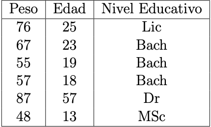

```{r setup, include=FALSE}
knitr::opts_chunk$set(echo = TRUE)
```

2. Dado x = (3,−5,31,−1,−9,10,0,18) y dado y = (1,1,−3,1,−99,−10,10,−7) realice lo siguiente:

Introduzca x y y como vectores en R.

```{r}
x <- c(3,-5,31,-1,-9,10,0,18)
y <- c(1,1,-3,1,-99,-10,10,-7)
```

Calcule la media, la varianza, la raíz cuadrada y la desviación estándar de y.

```{r}
mean(y)
var(y)
sqrt(abs(y))
sd(y)
```

Calcule la media, la varianza, la ra ́ız cuadrada y la desviacio ́n esta ́ndar de x.

```{r}
mean(x)
var(x)
sqrt(abs(x))
sd(x)
```


Calcule la correlaci ́on entre x y y.

```{r}
cor(x,y)
```

Escriba un comando en R para extraer las entradas 2 a la 7 de x.

```{r}

x[2:7]
```

Escriba un comando en R para extraer las entradas de y excepto la 2 y la 7.
```{r}
y[-c(2,7)]
```

Escriba un comando en R para extraer las entradas de y menores a -3 o mayores a 10.
```{r}
y[ 10 < y | y < -3 ]
```

Escriba un comando en R para extraer las entradas de x mayores a 0 y que sean nu ́meros pares.

```{r}
x[x%%2 == 0 & x > 0]
```

3. Introduzca en R la siguiente matriz a 4 × 3 usando:
A = matrix(c(1,2,3,4,5,6,7,8,9,10,11,12),nrow=4,"byrow"="true")
Luego, obtenga algunos elementos de la matriz de la siguiente manera: A[1,1:3], A[1:4,2], A[3,3], A[11], A[20], A[5,4], A[1,1,1] y explique qu ́e pasa en cada caso.

```{r}
A = matrix(c(1,2,3,4,5,6,7,8,9,10,11,12),nrow=4,"byrow"="true")

A[1,1:3] #muestra los primeros tres elementos de la fila uno
 
A[1:4,2] #de las cuatro filas muestra el segundo elemento

A[3,3] # elemento de la tercer fila y tercer columna

A[11] #el undecimo elemento contando de arriba hacia abajo

A[20] #el vigésimo elemento no existe en la tabla

A[5,4] #elemento de la quinta fila y cuarta columna no existe

A[1,1,1] #el tercer indice está de más
```

4. Investigue para qu ́e sirven los comandos de R as.matrix(...) y as.data.frame(...), expli- que y d ́e un ejemplo de cada uno.

as.matrix() cambiar el argumento ingresado en una matriz
```{r}
as.matrix(x)
```

as.data.frame() cambia el argumento a dataframe.

```{r}
as.data.frame(y)
```

5. Introduzca usando código R (no archivos) en un DataFrame la siguiente tabla de datos:

```{r}


data.frame(Peso = c(76,67,55,57,87,48),
           Edad = c(25,23,19,18,57,13),
           Nivel_Educativo  = factor(x = c("Lic","Bach","Bach","Bach","Dr","MSc"),
                                     levels = c("Bach","Lic","MSc","Dr")))
```
6. En muchas ocasiones nos interesa hacer referencia a determinadas partes o componentes de un vector. Defina el vector x = (2, −5, 4, 6, −2, 8), luego a partir de este vector defina instrucciones en R para generar los siguientes vectores:

- y = (2, 4, 6, 8), así definido y es el vector formado por las componentes positivas de x.
```{r}
x <- c(2, -5, 4, 6, -2, 8)
y <- x[x>0]

y
```

- z = (−5, −2), así definido z es el vector formado por las componentes negativas de x.
```{r}
z <- x[x<0]
z
```

- v = (−5, 4, 6, −2, 8), así definido v es el vector x eliminada la primera componente.
```{r}
v <- x[-1]
v  

```

w = (2, 4, −2). así definido w es el vector x tomando las componentes impares.
```{r}

w <- x[c(T,F)]

w
```

7. Queremos representar gráficamente la funci ́on coseno en el intervalo [0, 2π]. Para esto creamos el vector x de la siguiente forma x<-seq(0,2*pi,length=100). ¿Cu ́al es la diferencia entre las gra ́ficas obtenidas por comandos plot?


En el primer gráfico el eje x y el color no es especifican por lo que toman valores predeterminados, en el segundo gráfico la escala del eje x es x y su color es rojo.
```{r}

x<-seq(0,2*pi,length=100) 
plot(cos(x)) 
plot(x,cos(x),col="red")
```

8. Para tabla de Datos que viene en el archivo DJTable.csv el cual contiene los valores de las acciones de las principales empresas de Estados Unidos en el an ̃o 2010, usando el comando plot de R, grafique (en un mismo gra ́fico) las series de valores de las acciones de las empresas CSCO (Cisco), IBM, INTC (Intel) y MSFT (Microsoft).

```{r}
library(readr)
library(lubridate)
library(dplyr)

DJTable <- read_delim("DatosTarea1/DJTable.csv", 
    ";", escape_double = FALSE, trim_ws = TRUE)

names(DJTable)[1] <- "FECHA"

DJTable <- DJTable %>%
  mutate(FECHA = as.Date(FECHA,"%d/%m/%Y"))

str(DJTable)

plot(DJTable$CSCO,type = "l",col = "red", 
   main = "Stock chart", ylab = "", xlab = "")
lines(DJTable$IBM, type = "l", col = "green")
lines(DJTable$INTC, type = "l", col = "blue")
lines(DJTable$MSFT, type = "l", col = "purple")
```

9. Repita el ejercicio anterior usando funciones del paquete ggplot2.
```{r}
DJTable %>%
  ggplot(mapping = aes(x= FECHA)) +
  geom_line(mapping = aes(y= CSCO, color = "CSCO"))+
  geom_line(mapping= aes(y=IBM, color = "IBM")) +
  geom_line(mapping =  aes(y=INTC, color = "INTC"))+
  geom_line(mapping =  aes(y = MSFT, color = "MSFT"))+
  labs(x = "", y = "", title = "STOCK CHART")+
  theme_minimal()


              
```
 
 10. Cargue en un DataFrame el archivo EjemploAlgoritmosRecomendacion.csv y haga lo siguiente:
 
 
Calcule la dimensión de la Tabla de Datos.
```{r}
Datos <- read.table("DatosTarea1/EjemploAlgoritmosRecomendacion.csv",
                    header=TRUE, sep=";",dec=",",row.names=1)

dim(Datos)
```

Despliegue las primeras 2 columnas de la tabla de datos.

```{r}
Datos[,1:2]
```
 
Ejecute un “summary” y un “str” de los datos.

```{r}
summary(Datos)
str(Datos)
```

Calcule la Media y la Desviación Estándar para todas las variables cualesquiera. 

```{r}
lapply(Datos,sd) #desviación estandar

summary(Datos)[4,] # Media
```


Ahora repita los ítems anteriores pero leyendo el archivo como sigue:

Datos <- read.table(’EjemploAlgoritmosRecomendacion.csv’,
header=TRUE, sep=’;’,dec=’.’,row.names=1)

Explique porqué todo da mal o genera error.

```{r,eval=FALSE}
Datos <- read.table("DatosTarea1/EjemploAlgoritmosRecomendacion.csv",
header=TRUE, sep=";",dec=".",row.names=1)


dim(Datos)

Datos[,1:2]

summary(Datos) #nalgunas funciones no pueden calcular debido a que las columans fueron leídas como chr y no como númericas.
str(Datos)

lapply(Datos, sd) #de nuevo las columnas son de tip chr y no númericas
summary(Datos)[4,] #la función no retornó el calculo de la media debido al tipo de columnas

```

11. Usando el archivo de datos EjemploAlgoritmosRecomendacion.csv realice lo siguiente:

a) Grafique usando los comandos plot y qplot en el plano XY las variables Entrega vs Precio.
```{r}

```

