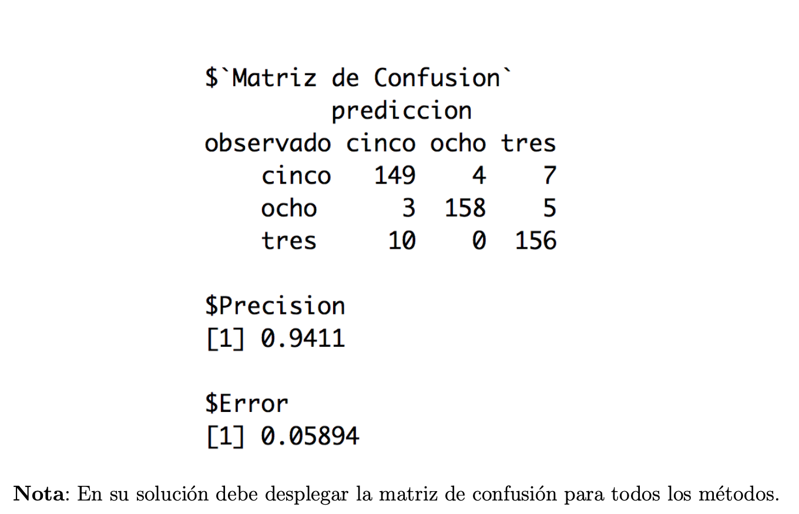
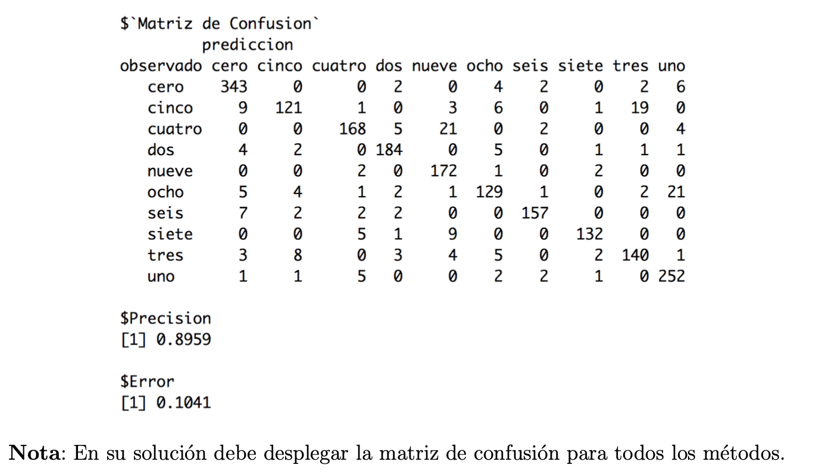
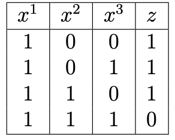
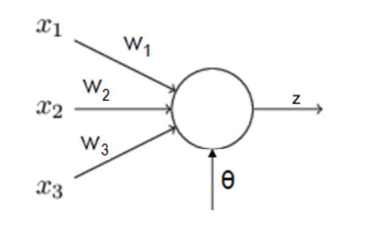

```{r setup, echo=FALSE, cache=FALSE}
library(knitr)
library(rmdformats)

## Global options
options(max.print="75")
opts_chunk$set(echo=TRUE,
               prompt=FALSE,
               tidy=TRUE,
               comment=NA,
               message=FALSE,
               warning=FALSE)
opts_knit$set(width=75)
```

# Pregunta 1 {.tabset .tabset-fade}

[30 puntos] En esta pregunta utiliza los datos (tumores.csv). Se trata de un conjunto de datos de características del tumor cerebral que incluye cinco variables de primer orden y ocho de textura y cuatro parámetros de evaluación de la calidad con el nivel objetivo. La variables son: Media, Varianza, Desviación estándar, Asimetría, Kurtosis, Contraste, Energía, ASM (segundo momento angular), Entropía, Homogeneidad, Disimilitud, Correlación, Grosor, PSNR (Pico de la relación señal-ruido), SSIM (Indice de Similitud Estructurada), MSE (Mean Square Error), DC (Coeficiente de Dados) y la variable a predecir tipo (1 = Tumor, 0 = No-Tumor).

Realice lo siguiente:

## 1. 

Cargue la tabla de datos tumores.csv en R y genere en R usando la función createDataPartition(...) del paquete caret la tabla de testing con una 25 % de los datos y con el resto de los datos genere una tabla de aprendizaje. Investigue cómo se hace la separación en training-testing con el paquete caret ¿Cuál es la ventaja respecto a usar sample?

```{r}
library(caret)

tumores <- read.table("Datos Tarea/tumores_V2.csv", sep = ",", dec = ".", header = TRUE, stringsAsFactors = TRUE)[,-1]

p <- createDataPartition(tumores$tipo, p = 0.75, list = FALSE)

ttesting <- tumores[-p,]
taprendizaje <- tumores[p,]


```

Ventaja: La ventaja de usar el paquete caret consiste en que a la hora de hacer la partición esta mantiene la misma proporción de la distribución de las categorías que tiene la variable a predecir.

## 2.

Usando Redes Neuronales (nnet) con el paquete traineR genere un modelo predictivo para la tabla de aprendizaje usando 2, 4 y 20 capas ocultas ¿Qué pasa en cada uno de los casos? Lo anterior con un número máximo de iteraciones igual a 1000 (recuerde adaptar el número máximo de pesos MaxNWts.

```{r}
library(traineR)
# 2 capas
modelo.nnet2 <- train.nnet(tipo~., data = taprendizaje, size = 2, maxit = 1000) #size indica los nodos
```

```{r}
# 4 capas
modelo.nnet4 <- train.nnet(tipo~., data = taprendizaje, size = 4, maxit = 1000 )

```

```{r}
# 20 capas
modelo.nnet20 <- train.nnet(tipo~., data = taprendizaje, size = 20,  maxit = 1000)

```

## 3. 
Repita los ejercicios anteriores usando neuralnet desde el paquete traineR con 3 capas ocultas, es decir, use hidden = c(k1, k2, k3) (determine usted el número adecuado para k1, k2 y para k3.

```{r cache=TRUE}

modelo.neuralnet2 <- train.neuralnet(formula = tipo~., data = taprendizaje,  hidden = c(6,4,2), linear.output = FALSE, threshold = 0.1, stepmax = 1e+06)


```

## 4. Compare todos los resultados de los ejercicios anteriores. ¿Cuál es mejor?
```{r}
tablaComparativa1 <- read.table("Tabla Comparativa tumores2.csv", sep = ",", dec = ".", header = TRUE)


```

# Pregunta 2. {.tabset .tabset-fade}

[30 puntos] Esta pregunta utiliza los datos sobre la conocida historia y tragedia del Titanic, usando los datos titanicV2020.csv de los pasajeros se trata de predecir la supervivencia o no de un pasajero.

Realice lo siguiente:

## 1. 
Cargue la tabla de datos titanicV2020.csv, asegúrese recodificar las variables cualitativas y de ignorar variables que no se deben usar.

```{r}
titanic <- read.table("Datos Tarea/titanicV2020.csv", sep = ",", dec = ".", header = TRUE, stringsAsFactors = TRUE)

titanic <- titanic[,-c(1,4,9,11)]

titanic <- na.omit(titanic)

titanic$Survived <- as.factor(ifelse(titanic$Survived == 1, "SI", "NO"))
```


## 2. 
Usando Redes Neuronales, con nnet del paquete traineR y con 80 % de los datos para tabla aprendizaje y un 20% para la tabla testing, genere un modelo predictivo para la tabla de aprendizaje, usando 4, 15 y 20 nodos en la capa oculta ¿Qué pasa en cada uno de los casos? Lo anterior con un número máximo de iteraciones igual a 1000, recuerde adaptar el número máximo de pesos MaxNWts.

```{r}

p <- createDataPartition(titanic$Survived, p = 0.8, list = FALSE)

ttesting <- titanic[-p,]
taprendizaje <- titanic[p,]

# 4 nodos
modelo.nnet4 <- train.nnet(Survived~. , data = taprendizaje, size = 4, maxit = 1000)
```

```{r}
#15 nodos

modelo.nnet15 <- train.nnet(Survived~., data = taprendizaje, size =15, maxit = 1000)
```

```{r}
#20 nodos

modelo.nnet20 <- train.nnet(Survived~., data = taprendizaje, size =20, maxit = 1000)
```

## 3. 
Repita los ejercicios anteriores usando neuralnet del paquete traineR con 4 capasocultas, es decir, use hidden = c(k1, k2, k3, k4) (determine usted el número adecuado para k1, k2, k3 y para k4. ¿Mejoran los resultados?

```{r cache=TRUE}
modelo.neuralnet <- train.neuralnet(formula = Survived~., data = taprendizaje,  hidden = c(9,7,5,3), linear.output = FALSE, threshold = 0.1, stepmax = 1e+06)
```


## 4. {.tabset .tabset-fade}

Con la tabla de testing calcule la matriz de confusión, la precisión, la precisión positiva, la precisión negativa, los falsos positivos, los falsos negativos, la acertividad positiva y la acertividad negativa para los modelos anteriores (los que fue posible generar). ¿Cuál es mejor? Compare además los resultados con los obtenidos en la tarea anterior ¿Cuál es mejor?


Función indices
```{r}
indices.general <- function(MC) {
  precision.global <- sum(diag(MC))/sum(MC)
  error.global <- 1 - precision.global
  precision.categoria <- diag(MC)/rowSums(MC)
  falsos.positivos<- MC[1,2]/rowSums(MC)[1]
  falsos.negativos<- MC[2,1]/rowSums(MC)[2]
  asertividad.positiva<-MC[2,2]/ colSums(MC)[2]
  asertividas.negativa<-MC[1,1]/ colSums(MC)[1]
  
  res <- list(precision.global = precision.global, error.global = error.global, 
              precision.categoria = precision.categoria, falsos.positivos= falsos.positivos, falsos.negativos=falsos.negativos,
              asertividad.positiva=asertividad.positiva,asertividas.negativa=asertividas.negativa)
  names(res) <- c( "Precisión Global", "Error Global", 
                  "Precisión por categoría","Falsos positivos","Falsos negativos","Asertividad Positiva", "Asertvidad Negativa")
  return(res)
}
```


### nnet {.tabset .tabset-fade}

#### 4 nodos

```{r}
prediccion.nnet4 <- predict(modelo.nnet4, ttesting, type = "class")

MC.nnet4 <- confusion.matrix(ttesting,prediccion.nnet4)

indices1 <- indices.general(MC.nnet4)
indices1
```

#### 15 nodos

```{r}
prediccion.nnet15 <- predict(modelo.nnet15, ttesting, type = "class")

MC.nnet15 <- confusion.matrix(ttesting,prediccion.nnet15)

indices2 <- indices.general(MC.nnet15)
indices2
```

#### 20 nodos

```{r}
prediccion.nnet20 <- predict(modelo.nnet20, ttesting, type = "class")

MC.nnet20 <- confusion.matrix(ttesting,prediccion.nnet20)

indices3 <- indices.general(MC.nnet20)
```

### Neuralnet

```{r}
prediccion.neuralnet <- predict(modelo.neuralnet, ttesting, type = "class")

MC.neuralnet <- confusion.matrix(ttesting, prediccion.neuralnet)

indices4 <- indices.general(MC.neuralnet)
indices4
```


### Comparación 

```{r}
#Se carga de tarea anterior
tablaComparativa <- read.table("Tabla Comparativa titanic2.csv", sep = ",", dec = ".", header = TRUE)

rownames(tablaComparativa1) <- c("arboles decision","rectangular", "triangular", "epanechnikov", "biweight", "triweight", "cos", "inv","linear","polynomial","radial", "sigmoid","Bosques Aleatorios", "Potenciación ADA", "XGBoosting")

indices1$`Precisión por categoría`<-sprintf("%f,%f", indices1$`Precisión por categoría`[1], indices1$`Precisión por categoría`[2])

indices2$`Precisión por categoría`<-sprintf("%f,%f", indices2$`Precisión por categoría`[1], indices2$`Precisión por categoría`[2])

indices3$`Precisión por categoría`<-sprintf("%f,%f", indices3$`Precisión por categoría`[1], indices3$`Precisión por categoría`[2])

indices4$`Precisión por categoría`<-sprintf("%f,%f", indices4$`Precisión por categoría`[1], indices4$`Precisión por categoría`[2])

#Se fusionan todas los indices con la tabla

tablaComparativa <- rbind(as.data.frame(indices1), as.data.frame(indices2), as.data.frame(indices3), as.data.frame(indices4))

rownames(tablaComparativa) <- c("nnet 4 nodos", "nnet 15 nodos", "nnet 20 nodos", "neuralnet")
tablaComparativa
```
Según la tabla el método fue nnet con 15 y 20 nodos, teniendo ambos la mayor precisión global.

Tabla de comparación con métodos anteriores
```{r}
#tabla con los resultados de tareas anteriores
tablaComparativa <- rbind(tablaComparativa1,tablaComparativa)

tablaComparativa

#Mejor método segun precisión global
tablaComparativa%>%
  filter(Precisión.Global ==  max(Precisión.Global))

write.csv(tablaComparativa,"Tabla Comparativa titanic3.csv", row.names = FALSE)

```

# Ejercicio 3 {.tabset .tabset-fade}

[30 puntos] En este ejercicio vamos a predecir números escritos a mano (Hand Written Digit Recognition), la tabla de aprendizaje está en el archivo ZipDataTrainCod.csv y la tabla de testing está en el archivo ZipDataTestCod.csv. En la figura siguiente se ilustran los datos:

```{r}
knitr::include_graphics("Captura de Pantalla 2020-10-02 a la(s) 13.54.31.png")
```

Para esto realice lo siguiente (podría tomar varios minutos los cálculos: 

## 1. 

Cargue las tablas aprendizaje y testing en R de los archivos ZipDataTrainCod.csv y ZipDataTestCod.csv respectivamente.

```{r}

ttesting <- read.table("Datos Tarea/ZipDataTestCod.csv",sep = ";", dec = ".", header = TRUE, stringsAsFactors = T)

taprendizaje <- read.table("Datos Tarea/ZipDataTestCod.csv", sep = ";", dec = ".", header = TRUE, stringsAsFactors = T )


```

## 2. 

Use el método de Redes Neuronales con el método y los parámetros que usted considere más conveniente para generar un modelo predictivo para la tabla ZipDataTrainCod.csv, luego calcule para los datos de testing, en el archivo ZipDataTestCod.csv, la matriz de confusión, la precisión global y la precisión para cada una de las categorías. ¿Son buenos los resultados? Explique.

```{r cache=TRUE}

modelo.nnet <- train.nnet(formula =  Numero~., data = taprendizaje, size = 15, MaxNWts = 10000)

prediccion <- predict(modelo.nnet, ttesting)

MC <- confusion.matrix(ttesting,prediccion)
MC

indices1 <- indices.general(MC)
indices1
```

## 3.

Compare los resultados con los obtenidos en la tarea anterior.
```{r}
#Se carga la tabla con resultados de tareas anteriores
tablaComparativa1 <- read.table("Tabla Comparativa ZipData2.csv", sep = ",", dec = ".", header = TRUE)
rownames(tablaComparativa1) <- c("arboles decision","rectangular", "triangular", "epanechnikov", "biweight", "triweight", "cos", "inv","linear","polynomial","radial", "sigmoid","Bosques Aleatorios", "XGBoosting")

indices1$`Precisión por categoría`<-sprintf("%f, %f, %f, %f, %f, %f, %f, %f, %f, %f",
                                            indices1$`Precisión por categoría`[1],
                                            indices1$`Precisión por categoría`[2],
                                            indices1$`Precisión por categoría`[3],
                                            indices1$`Precisión por categoría`[4],
                                            indices1$`Precisión por categoría`[5],
                                            indices1$`Precisión por categoría`[6],
                                            indices1$`Precisión por categoría`[7],
                                            indices1$`Precisión por categoría`[8],
                                            indices1$`Precisión por categoría`[9],
                                            indices1$`Precisión por categoría`[10])


tablaComparativa <- rbind(as.data.frame(indices1), tablaComparativa1)
rownames(tablaComparativa)[1] <- c("nnet")
tablaComparativa

#Mejor método segun precisión global
tablaComparativa%>%
  filter(Precisión.Global ==  max(Precisión.Global))

write.csv(tablaComparativa,"Tabla Comparativa ZipData3.csv")
```

## 4. {.tabset .tabset-fade}

Repita los ejercicios 1, 2 y 3 pero usando solamente los 3s, 5s y los 8s, ¿Mejoraron los resultados? La respuesta en el método KNN debería ser:

```{r}

```

### 4.1

Cargue las tablas aprendizaje y testing en R de los archivos ZipDataTrainCod.csv y ZipDataTestCod.csv respectivamente.
```{r}
library(dplyr)

#Tabla de datos con solo 3s, 5s y 8s para la variable Numero

ttesting1 <- ttesting%>%filter(Numero == c("tres", "cinco", "ocho"))

ttesting1$Numero <- factor(ttesting1$Numero)

taprendizaje1 <- taprendizaje%>%filter(Numero == c("tres", "cinco", "ocho"))

taprendizaje1$Numero <- factor(taprendizaje1$Numero)

```

### 4.2

Use el método de Redes Neuronales con el método y los parámetros que usted considere más conveniente para generar un modelo predictivo para la tabla ZipDataTrainCod.csv, luego calcule para los datos de testing, en el archivo ZipDataTestCod.csv, la matriz de confusión, la precisión global y la precisión para cada una de las categorías. ¿Son buenos los resultados? Explique.

```{r cache=TRUE}

modelo.nnet1 <- train.nnet(formula =  Numero~., data = taprendizaje1, size = 15, MaxNWts = 10000)

prediccion1 <- predict(modelo.nnet1, ttesting1)

MC1 <- confusion.matrix(ttesting1,prediccion1)
MC1

indices1 <- indices.general(MC1)
indices1
```
Aumentó La precisión global pero no tanto como considerar el modelo bueno aún, Considero que es un modelo intermedio.

### 4.3

Compare los resultados con los obtenidos en la tarea anterior.
```{r}
indices1$`Precisión por categoría`<-sprintf("%f, %f, %f",
                                            indices1$`Precisión por categoría`[1],
                                            indices1$`Precisión por categoría`[2],
                                            indices1$`Precisión por categoría`[3])


tablaComparativa <- rbind(as.data.frame(indices1), tablaComparativa1)
rownames(tablaComparativa)[1] <- c("nnet")
tablaComparativa

#Mejor método segun precisión global
tablaComparativa%>%
  filter(Precisión.Global ==  max(Precisión.Global))
```

Aunque mejora la precisión global, sigue sin ser el mejor modelos de todos los métodos aplicados en tareas anteriores. Sin embargo tampoco el es peor, pues su precisión global no disminuye de 90%.

## 5. {.tabset .tabset-fade}

Repita los ejercicios 1, 2 y 3 pero reemplazando cada bloque 4 × 4 de píxeles por su promedio, ¿Mejoraron los resultados? Recuerde que cada bloque 16×16 está representado por una fila en las matrices de aprendizaje y testing. La respuesta en el método KNN debería ser:


```{r}

```

### 5.1

Para taprendizaje
```{r}


filas <- dim(taprendizaje)[1]
columnas <- dim(taprendizaje)[2]

#nueva tabla promedio
taprendizaje2 <- as.data.frame(matrix(ncol=sqrt(columnas), nrow=filas))

serie <- seq(4,16,4) 


for (f in 1:filas) {
  
  x1 <-  matrix( , nrow = 4, ncol = 4)
  m <- matrix(taprendizaje[f,-1],nrow = 16,ncol = 16)
  
  for(i in 1:4){
    for (j in 1:4){
    x1[i,j] <- mean(unlist(m[(serie[i]-3):(serie[i]),(serie[j]-3):(serie[j])]))
    }
    }
  taprendizaje2[f,] <- as.vector(x1)
}

#Se agrega la columna de los números
taprendizaje2$Numero <- taprendizaje$Numero

#Se ordenan las columnas
taprendizaje2 <- taprendizaje2[, c(17,1:16)]
```

Para ttesting
```{r}
filas <- dim(ttesting)[1]
columnas <- dim(ttesting)[2]

#nueva tabla promedio
ttesting2 <- as.data.frame(matrix(ncol=sqrt(columnas), nrow=filas))

serie <- seq(4,16,4) 


for (f in 1:filas) {
  
  x1 <-  matrix( , nrow = 4, ncol = 4)
  m <- matrix(ttesting[f,-1],nrow = 16,ncol = 16)
  
  for(i in 1:4){
    for (j in 1:4){
    x1[i,j] <- mean(unlist(m[(serie[i]-3):(serie[i]),(serie[j]-3):(serie[j])]))
    }
    }
  ttesting2[f,] <- as.vector(x1)
}

#Se agrega la columna de los números
ttesting2$Numero <- ttesting$Numero

#Se ordenan las columnas
ttesting2 <- ttesting2[, c(17,1:16)]

```

### 5.2
Use el método de Redes Neuronales con el método y los parámetros que usted considere más conveniente para generar un modelo predictivo para la tabla ZipDataTrainCod.csv, luego calcule para los datos de testing, en el archivo ZipDataTestCod.csv, la matriz de confusión, la precisión global y la precisión para cada una de las categorías. ¿Son buenos los resultados? Explique.

```{r cache=TRUE}
modelo.nnet2 <- train.nnet(formula =  Numero~., data = taprendizaje2, size = 15, MaxNWts = 10000)

prediccion2 <- predict(modelo.nnet2, ttesting2)

MC2 <- confusion.matrix(ttesting2,prediccion2)
MC2

indices1 <- indices.general(MC2)
indices1
```

### 5.3

Compare los resultados con los obtenidos en la tarea anterior.

```{r}
indices1$`Precisión por categoría`<-sprintf("%f, %f, %f, %f, %f, %f, %f, %f, %f, %f",
                                            indices1$`Precisión por categoría`[1],
                                            indices1$`Precisión por categoría`[2],
                                            indices1$`Precisión por categoría`[3],
                                            indices1$`Precisión por categoría`[4],
                                            indices1$`Precisión por categoría`[5],
                                            indices1$`Precisión por categoría`[6],
                                            indices1$`Precisión por categoría`[7],
                                            indices1$`Precisión por categoría`[8],
                                            indices1$`Precisión por categoría`[9],
                                            indices1$`Precisión por categoría`[10])


tablaComparativa <- rbind(as.data.frame(indices1), tablaComparativa1)
rownames(tablaComparativa)[1] <- c("nnet")
tablaComparativa

#Mejor método segun precisión global
tablaComparativa%>%
  filter(Precisión.Global ==  max(Precisión.Global))

```

Los resultados no mejoran al menos para este caso. 

# Ejercicio 4

[10 puntos] Para la Tabla de Datos que se muestra seguidamente donde xj para j = 1,2,3 son las variables predictoras y la variable a predecir es z diseñe y programe a pie una Red Neuronal de una capa (Perceptron):
```{r}

```
Es decir, encuentre todos los posibles pesos w1, w2, w3 y umbrales θ para la Red Neuronal que se muestra en el siguiente gráfico:

```{r}

```

Use una función de activación tipo Tangente hiperbólica, es decir:
$$ f(x) = \frac{2}{1+e^{-2x}} -1 $$
Para esto escriba una función en R que haga variar los pesos wj con j = 1, 2, 3 en los siguientes valores v=(-1,-0.9,-0.8,...,0,...,0.8,0.9,1) y haga variar θ en u=(0,0.1,...,0.8,0.9,1). Escoja los pesos wj con j = 1, 2, 3 y el umbral θ de manera que se minimiza el error cuadrático medio:

$$ E(w_1,w_2,w_3) = \frac{1}{4}\sum_{i=1}^{4}\Big[ I \Big[ f \Big( \sum_{j=1}^{3} w_j * x_i^j - θ \Big) \Big] - z_i\Big]^2 , $$
donde $x_j^i$ es la entrada en la fila i de la variable $x^j$ e $I(z)$ se define como sigue:
$$ I(t)= \left\{ \begin{array}{lcc}
             1 &   si  & t \geq 0 \\
              0 &  si & t < 0. 
             \end{array}
   \right.$$


```{r}

x1 <- c(1,1,1,1)
x2 <- c(0,0,1,1)
x3 <- c(0,1,0,1)
z <- c(1,1,1,0)


tabla <- data.frame(x1,x2,x3,z)

#función de activación
tangenteHiperb <- function(x){
  
  y <- 2/(1+exp(-2*x)) - 1
  
  return(y)
} 

I <- function(t){
  if(t >= 0){
    return(1)
  }else {
    return(0)
  }
}

#Pesos
v <- seq(-1,1,0.1)
u <- seq(0,1,0.1) 


  
  
  
  for (omega in seq(0.1,0.3,0.1)) {
  for (w1 in seq(0.1,0.3,0.1)) {
    for (w2 in seq(0.1,0.3,0.1)) {
      for (w3 in seq(0.1,0.3,0.1)) {
        s <- 0
        for (i in 1:4) {
          
        s <- s + (I(tangenteHiperb(w1*tabla[i,1] - omega + w2*tabla[i,2] - omega + w3*tabla[i,3] - omega)) - tabla[i,4])^2
        
        #print(c(omega,w1,w2,w3,s))
      }
        print(c(omega,w1,w2,w3,s/4))
    }
  }
}
  
  #print(c(i,omega,w1,w2,w3,s^2))
  
}


for (b in 1:3) {
  
  s <- 2*b
  
  print(c(b,s))
}

```

