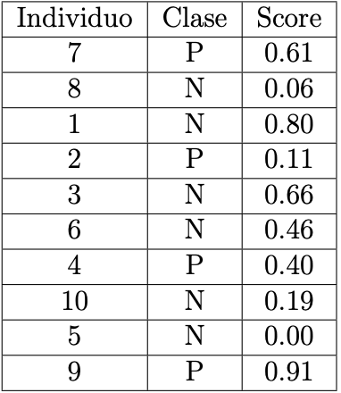

```{r setup, echo=FALSE, cache=FALSE}
library(knitr)
library(rmdformats)

## Global options
options(max.print="75")
opts_chunk$set(echo=TRUE,
               prompt=FALSE,
               tidy=TRUE,
               comment=NA,
               message=FALSE,
               warning=FALSE)
opts_knit$set(width=75)
```

# Ejercicio 1: [40 puntos] {.tabset .tabset-fade}

Esta pregunta también utilizan nuevamente los datos tumores.csv. El objetivo de este ejercicio es comparar todos los métodos predictivos vistos en el curso con esta tabla de datos. Aquí interesa predecir en la variable tipo, para los métodos SVM, KNN, Árboles, Bosques, Potenciación, eXtreme Gradient Boosting, LDA, Bayes, Redes Neuronales, KNN y Potenciación se desea determinar cuál método produce mejores resultados usando la curva ROC. Para esto realice lo siguiente:

```{r}
library(traineR)
tumores <- read.table("tumores_V2.csv", sep = ",", dec = ".", header = TRUE, stringsAsFactors = TRUE)[,-1]

muestra <- sample(1:nrow(tumores),floor(nrow(tumores)*0.25))
ttesting <- tumores[muestra,]
taprendizaje <- tumores[-muestra,]


```

## 1. {.tabset .tabset-fade}

Grafique la curva ROC para todos modelos predictivos generados en la tarea anterior. Use el parámetro type = ‘‘prob’’ en las funciones predict del paquete traineR para retornar la probabilidad en lugar de la clase. ¿Cuál método parece ser mejor?

```{r}
plotROC <- function(prediccion, real, adicionar = FALSE, color = "red") {
  pred <- ROCR::prediction(prediccion, real)    
  perf <- ROCR::performance(pred, "tpr", "fpr")
  plot(perf, col = color, add = adicionar, main = "Curva ROC")
  segments(0, 0, 1, 1, col='black')
  grid()  
}
areaROC <- function(prediccion, real) {
  pred <- ROCR::prediction(prediccion, real)
  auc <- ROCR::performance(pred, "auc")
  return(attributes(auc)$y.values[[1]])
}
```

### SVM

```{r}
modelo <- train.svm(tipo ~ ., data = taprendizaje)
prediccion1 <- predict(modelo, ttesting, type = "prob")

Score1 <- prediccion1$prediction[,2]
Clase1 <- ttesting$tipo

```

### KNN

```{r}
modelo <- train.knn(tipo ~ ., data = taprendizaje)
prediccion2 <- predict(modelo, ttesting, type = "prob")

Score2 <- prediccion2$prediction[,2]
Clase2 <- ttesting$tipo
```

### Arboles de Decisión

```{r}
modelo <- train.rpart(tipo ~ ., data = taprendizaje)
prediccion3 <- predict(modelo, ttesting, type = "prob")

Score3 <- prediccion3$prediction[,2]
Clase3 <- ttesting$tipo
```

### Potenciación

```{r}
modelo <- train.ada(tipo ~ ., data = taprendizaje, iter=80,nu=1,type="real")
prediccion4 <- predict(modelo, ttesting, type = "prob")

Score4 <- prediccion4$prediction[,2]
Clase4 <- ttesting$tipo
```

### Extreme Gradient Boosting

```{r}
modelo <- train.xgboost(tipo ~ ., data = taprendizaje, nrounds = 500,verbose = F)
prediccion5 <- predict(modelo, ttesting, type = "prob")

Score5 <- prediccion5$prediction[,2]
Clase5 <- ttesting$tipo
```

### LDA

```{r}
library(MASS)

modelo <- lda(tipo ~ ., data = taprendizaje)
prediccion6 <- predict(modelo, ttesting, type = "prob")

Score6 <- prediccion6$posterior[,2]
Clase6 <- ttesting$tipo
```

### Bayes

```{r}
modelo <- train.bayes(tipo ~ ., data = taprendizaje)
prediccion7 <- predict(modelo, ttesting, type = "prob")

Score7<- prediccion7$prediction[,2]
Clase7 <- ttesting$tipo
```

### Redes Neuronales

```{r}
modelo <- train.nnet(tipo ~ ., data = taprendizaje, size = 2, maxit = 1000)
prediccion8 <- predict(modelo, ttesting, type = "prob")

Score8 <- prediccion8$prediction[,2]
Clase8 <- ttesting$tipo
```

### Bosques Aleatorios

```{r}
modelo <- train.randomForest(tipo ~ ., data = taprendizaje)
prediccion9 <- predict(modelo, ttesting, type = "prob")

Score9 <- prediccion9$prediction[,2]
Clase9 <- ttesting$tipo
```

### Curvas ROC

```{r, fig.width= 12, fig.height=6}
plotROC(Score1, Clase1)
plotROC(Score2, Clase2, adicionar = TRUE, color = "blue")
plotROC(Score3, Clase3, adicionar = TRUE, color = "green")
plotROC(Score4, Clase4, adicionar = TRUE, color = "magenta")
plotROC(Score5, Clase5, adicionar = TRUE, color = "yellow")
plotROC(Score6, Clase6, adicionar = TRUE, color = "orange")
plotROC(Score7, Clase7, adicionar = TRUE, color = "purple")
plotROC(Score8, Clase8, adicionar = TRUE, color = "lightblue")
plotROC(Score9, Clase9, adicionar = TRUE, color = "steelblue")
```

Según el gráfico anterior el método de Bosques Aleatorios es el mejor,pues pareciera que comprende más área.

## 2.

Calcule en área bajo curva ROC para todos los modelos predictivos generados en la tarea anterior. ¿Cuál método es el mejor según este criterio?

```{r}
areas <- c(areaROC(Score1, Clase1),
      areaROC(Score2, Clase2),
      areaROC(Score3, Clase3),
      areaROC(Score4, Clase4),
      areaROC(Score5, Clase5),
      areaROC(Score6, Clase6),
      areaROC(Score7, Clase7),
      areaROC(Score8, Clase8),
      areaROC(Score9, Clase9))

names(areas) <- c("SVM", "KNN", "Arboles", "Potenciación", "eXtreme Gradient Boosting","LDA", "Bayes", "Redes Neuronales", "Bosques")

# Mejor método según la área
areas[areas == max(areas)]
```

# Ejercicio 2: [30 puntos] {.tabset .tabset-fade}

 Dada la siguiente tabla:
 
```{r}

```
 
## 1.

Usando la definición de curva ROC calcule y grafique “a mano” la curva ROC, use un umbral $T = 0$ y un paso de $0,05$. Es decir, debe hacerlo variando el umbral y calculando las matrices de confusión.


