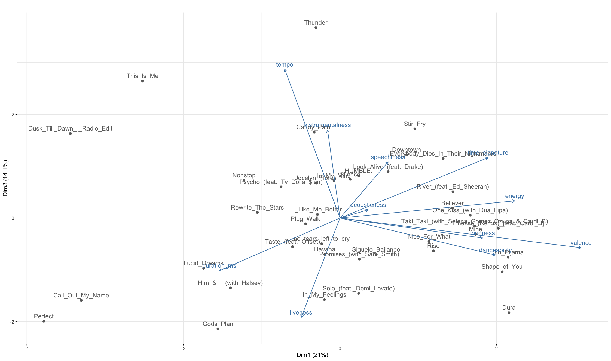
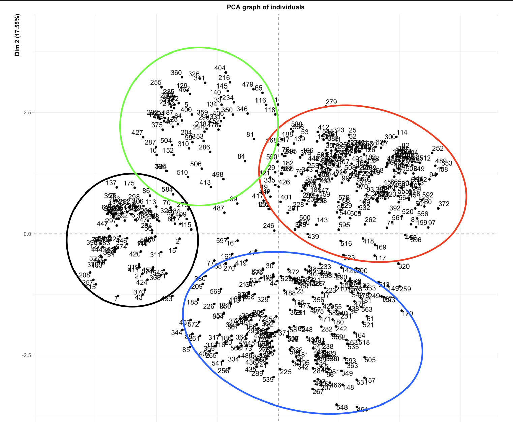
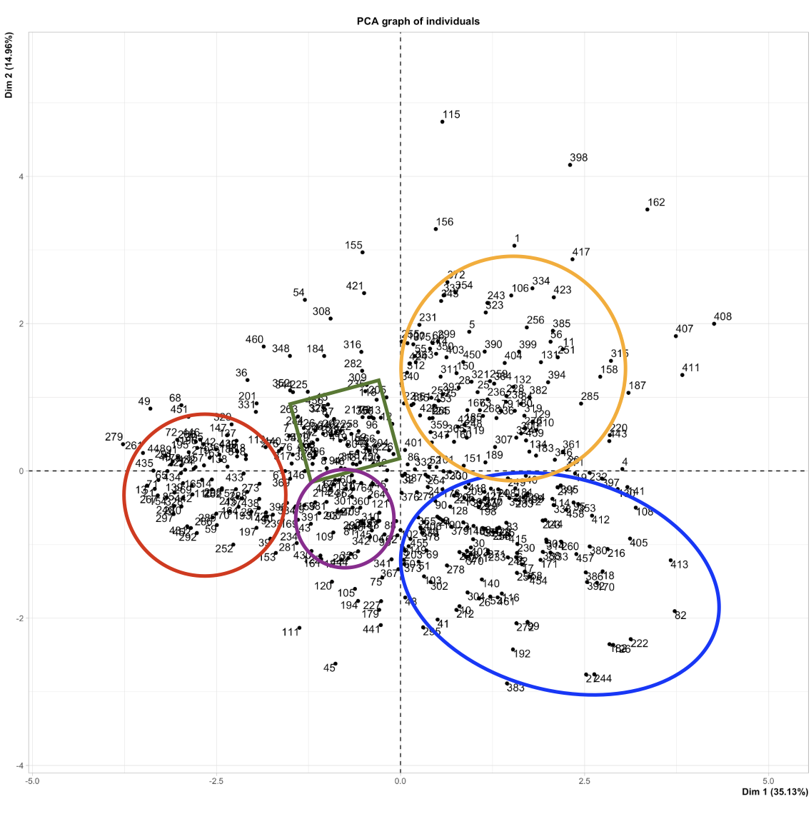
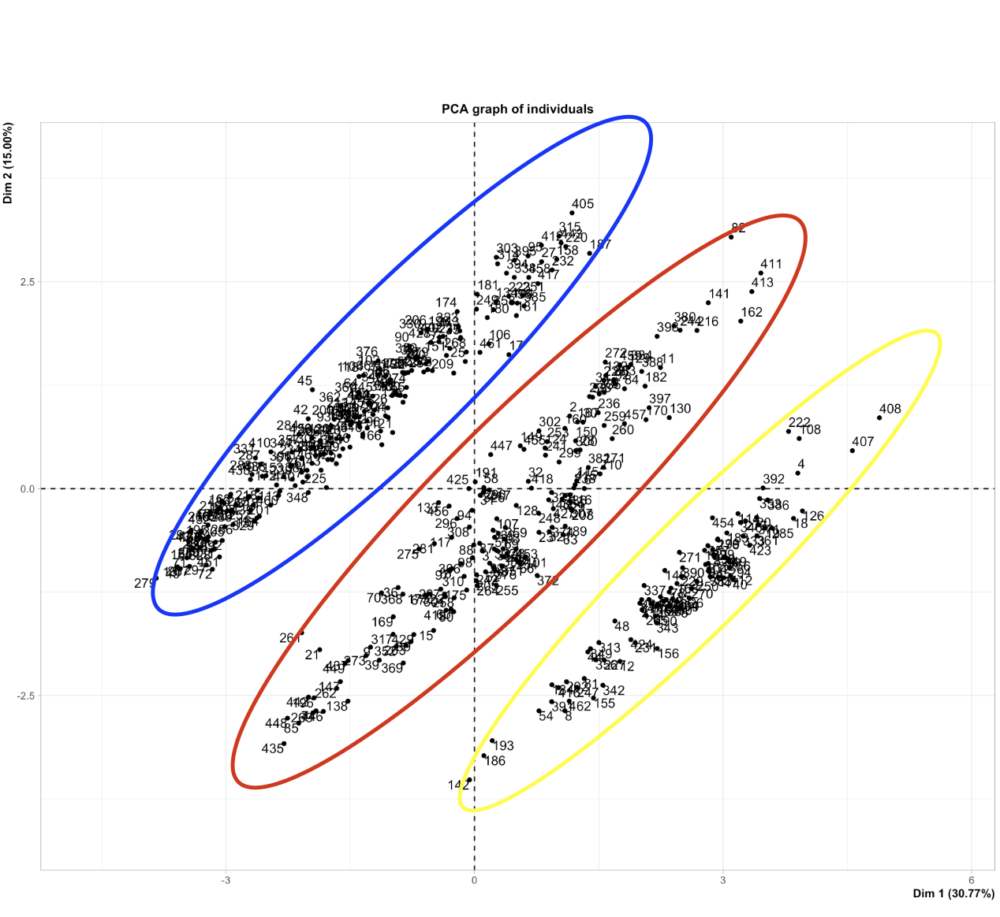

```{r setup, include=FALSE}
library(knitr)
library(rmdformats)
library(ggplot2)
library(GGally)

knitr::opts_chunk$set(echo = TRUE)

options(max.print="75")

opts_chunk$set(echo=TRUE,
	             cache=FALSE,
               prompt=FALSE,
               tidy=TRUE,
               comment=NA,
               message=FALSE,
               warning=FALSE)
```


# Pregunta 1 {.tabset .tabset-fade}

En este ejercicio vamos a usar la tabla de datos SpotifyTop2018 40 V2.csv, que contiene una lista de 40 de las canciones más reproducidas en Spotify en el año 2018. Los datos incluyen una serie de características importantes del audio de cada canción. \n
La tabla contiene 40 filas y 11 columnas, las cuales se explican a continuación. \n
danceability: Describe qué tan apta para bailar es la canción \n
denergy: Representa una medida de intensidad y actividad. \n
dloudness: Sonoridad general de la pista en decibelios. \n
dspeechiness: Detecta la presencia de palabras en la canción. \n
dacousticness: Indica qué tan acústica es la canción. \n
dinstrumentalness: Indica si la canción contiene o no voces. \n
dliveness: Detecta la presencia de público en la grabación. \n
dvalence: Describe la positividad musical transmitida por la canción. \n
dtempo: Es el tempo estimado general de una pista en beats por minuto. \n
dduration ms: Es la duración de la canción en milisegundos. \n
dtime signature: Especifica cuántos beats hay en cada barra o medida. \n
Nota: Todas son variables numéricas y no tienen NAs. Realice lo siguiente: \n

```{r}
library(readr)

SpotifyTop2018_40_V2 <- read.table("Datos de la Presentación y para la Tarea/SpotifyTop2018_40_V2.csv", row.names = 1, header = TRUE, sep = ",", dec = ".")
```

## a) Calcule el resumen numérico, interprete los resultados para dos variables.
```{r}
summary(SpotifyTop2018_40_V2)
```

Duration _ms: La canción más larga dura 191.70 milisegundos y la más corta 77 milisegundos.
Time signature: La canción con más beats cuenta con 268867 y con 95467 la que tiene menos.

## b) Realice el test de normalidad para una variable e interprete el resultado

```{r}
promedio <- mean(SpotifyTop2018_40_V2$duration_ms) 
desviacion <- sd(SpotifyTop2018_40_V2$duration_ms) 
values <- dnorm( SpotifyTop2018_40_V2$duration_ms, mean = promedio, sd = desviacion) 
values <- c(values, hist(SpotifyTop2018_40_V2$duration_ms,  plot = F)$density) 
hist(SpotifyTop2018_40_V2$duration_ms, col = '#00FF22AA', border=F, axes=F,
  freq = F, ylim = range(0, max(values)), ylab = '', 
  main = 'Spotify Top 2018', xlab = "Duración en microsegundos") 
axis(1, col=par('bg'), col.ticks='grey81', lwd.ticks=1, tck=-0.025) 
axis(2, col=par('bg'), col.ticks='grey81', lwd.ticks=1, tck=-0.025) 
curve(dnorm(x, mean = promedio, sd = desviacion), add=T, col='black', lwd=2)
legend('right', legend = 'Curva Normal', col = 'black', lty=1, cex=.5)
```
Según el gráfico parece que la "cola" de la distribución apunta hacia la izquierda, esto quiere decir que la mayor parte de las canciones tiene  una duración relativamente larga.

## c) Realice un gráfico de dispersión e interprete dos similitudes en el gráfico.

```{r}
eliminar_atipicos <- function(df) {
  df[] <- lapply(df, function(x) {
    if(is.numeric(x)) {
      atipicos <- boxplot(x, plot = F)$out
      x[x %in% atipicos] <- NA_real_
      return(x)
    }
    return(x)
  })
  df <- as.data.frame(df)
  na.omit(df)
}

datos = eliminar_atipicos(SpotifyTop2018_40_V2)
  
  #as.data.frame(scale(SpotifyTop2018_40_V2))

ggpairs(datos[,-11], lower = list(continuous = wrap("smooth", size=1)))
```
Las variables valance y energy tienen una relacion positiva fuerte. Por otro lado, tempo y valance se relacionan inversamente.

## d) Para dos variables identifique los datos atípicos, si los hay.

```{r}
SpotifyTop2018_40_V2[!rownames(SpotifyTop2018_40_V2) %in% rownames(datos),]

```
```{r}
boxplot(SpotifyTop2018_40_V2$duration_ms, plot = F)$out
boxplot(SpotifyTop2018_40_V2$instrumentalness, plot = F)$out
```
## e) Calcule la matriz de correlaciones, incluya alguna de las imágenes que ofrece R e interpréte dos de las correlaciones. Debe ser una interpretación dirigida a una persona que no sabe nada de estadística.

```{r,fig.height = 2, fig.width = 2}
library(corrplot)
library(ellipse)

matriz.correlaciones <- cor(SpotifyTop2018_40_V2)
matriz.correlaciones

corrplot(matriz.correlaciones)
plotcorr(matriz.correlaciones, col = "red")
```
Según el gráfico de correlaciones, las canciones con positividad músical (valance) también son bastante bailables (danceability), enérgicas y bulliciosas. Sin embargo tienen un tempo menor y una duración más corta.


## f) Efectúe un ACP y dé una interpretación siguiendo los siguientes pasos:

```{r}
library(FactoMineR)
library(factoextra)

res <-PCA(SpotifyTop2018_40_V2, scale.unit=TRUE, ncp=5, graph = FALSE)
```


En el círculo de correlación determine la correlación entre las variables.

```{r, fig.height= 4, fig.width= 8}
plot(res, axes=c(1, 2), choix="var", col.var="blue",new.plot=TRUE)
```
En el círculo de correlación es más claro que las variables loudness y energy se relacionan positivamente. También se aprecia que las canciones con más instrumental tienen mayor duración, pero son opuestas a la bailabilidad, palabras en la canción y positividad.


Explique la formación de los clústeres basado en la sobreposición del círculo y el plano.

```{r, fig.height= 4, fig.width= 8}
fviz_pca_biplot(res,col.var = "#2E9FDF",col.ind = "#696969")
```
Basado en el gráfico, en el cuarto cuadrante se agruparon las cancionen que  compartían duración, acústica y bailabilidad, esto opuesto al primero que posee las canciones con más durabilidad, instrumental y público en la grabación. El segundo cuadrante tiene las canciones con más energía y bulla, contrario al tercer cuadrante compuesto de canciones de tonos bajos y nostálgicos. 

\· En el plano de los componentes 1 y 3 interprete las canciones In My Feelings, In My Mind, Havana, Candy Paint y HUMBLE, que son mal representadas en los componentes 1 y 2.

```{r}

```
En los componentes 1 y 3 In My Feelings y Havanna se representan como canciones de larga duración y con público grabado. In My Mind y Humble son descritas como con canciones con más palabras, mayor compas y energía y finalmente Candy Paint es más instrumental y tiene un mayor tempo
\n \n


# Pregunta 2.  {.tabset .tabset-fade}
En este ejercicio vamos a usar los datos TablaAffairs.csv, los cuales recopilan información sobre infidelidades en parejas casadas, como lo es la edad de la persona, años de casado y el nivel de educación.

La tabla contiene 601 filas y 9 columnas, las cuales se explican a continuación. \n
TiempoInfiel: Medida del tiempo que pasó en la relación fuera del matrimonio. \n
Genero: Género del individio \n
Edad: Edad del individuo \n
AnnosCasado: Años que lleva casado\n
Hijos: Indica si hay hijos en el matrimonio o no. \n
Religioso: Índice del grado de religiosidad. Entre más alto más religioso. \n
Educación: Indice del grado de educación. Entre más alto, mayor educación. \n
Ocupacion: Indica la categoría de ocupación de la persona. \n
Valoracion: Valoración que da el individuo al matrimonio.\n
Realice lo siguiente:

```{r}
TablaAffairs <- read.table("Datos de la Presentación y para la Tarea/TablaAffairs.csv", sep = ";", dec = ".", header = TRUE, row.names = 1)
```

## a) Calcule el resumen numérico, interprete los resultados para una variable.
```{r}
summary(TablaAffairs)
```

EL tiempo medio cometiendo infidelidad de las personas son 1 año y 4 meses, el máximo es de 12 años y el minímo de 0.

## b) Calcule la matriz de correlaciones, incluya alguna de las imágenes que ofrece R e interpréte dos de las correlaciones. Debe ser una interpretación dirigida a una persona que no sabe nada de estadística.

```{r, fig.height= 4, fig.width= 8}
TablaAffairsCuantit <- Filter(is.numeric,TablaAffairs)
matriz.correlaciones2 <- cor(TablaAffairsCuantit)

matriz.correlaciones2

corrplot(matriz.correlaciones2)

```
Según el gráfico de la matriz de correlaciones el tiempo de infidelidad aumenta si las personas indican ser religiosas. Por otro lado, si llevan muchos años de casados el tiempo siendo infieles crece. También parece ser que las personas religiosas llevan más tiempo casadas. 

## c) Usando solo las variables numéricas efectué un ACP y dé una interpretación siguiendo los siguientes pasos: 
1) en el plano principal encuentre 4 clústeres. \n

```{r, echo= FALSE}

```


2) en el círculo de correlación determine la correlación entre las variables. \n

```{r, fig.height= 4, fig.width= 8}
modelo <- PCA(TablaAffairsCuantit, scale.unit=TRUE, ncp=5, graph = FALSE)

plot(modelo, axes=c(1, 2), choix="var", col.var="red", new.plot=TRUE)
```
Las variables de Educación y ocupación relacionan positivamente. \n
Tiene sentido que la Edad y los Años Casados tengan una relación fuerte y positiva; aunque no estén bien representadas Religioso y Tiempo de Infidelidad se relacionan positivamente con estas también.

3) Explique la formación de los clústeres basado en la sobre-posición del círculo y el plano.

```{r,fig.height= 4, fig.width= 8}
fviz_pca_biplot(modelo, col.var = "#2E9FDF",col.ind = "#696969")
```
Según el gráfico anterior, parece que el mayor número de personas que cometió infidelidad lo hizo por poco tiempo, eran de edades no avanzadas, no religiosos y con pocos años casados. Su educación parece ser indiferente para este grupo, hay otro grupo con Educación y Trabajando que también concentra una cantidad importante que no se relaciona con ninguna de las demás variables.


## d) Ahora convierta las variables Género e Hijos en Código Disyuntivo Completo y repita el ACP ¿Se gana interpretabilidad al convetir Género e Hijos en Código Disyuntivo Completo? 
```{r, fig.height= 4, fig.width= 8}
library(dummies)
TablaAffairs1 <- dummy.data.frame(TablaAffairs)

modelo1 <- PCA(TablaAffairs1, scale.unit=TRUE, ncp=5, graph = FALSE)

fviz_pca_biplot(modelo1, col.var = "#2E9FDF",col.ind = "#696969")
```
Si, parece ser que las personas que se consideran felices en la relación no llevan mucho tiempo de casadas y su tiempo siendo infieles es menor, además no tienen hijos. Las personas que indicaron que se sentían infelices muestran todo lo contrario. El género parece ser independiente del tiempo de infidelidad o de si son felices. 

# Pregunta 3.  {.tabset .tabset-fade}
En este ejercicio vamos a realizar un ACP para la tabla SAheart.csv la cual contiene variables numéricas y categóicas mezcladas. La descripción de los datos es la siguiente: \n
Datos Tomados del libro: The Elements of Statistical Learning Data Mining, Inference, and Prediction de Trevor Hastie, Robert Tibshirani y Jerome Friedman de la Universidad de Stan- ford. .Example: South African Heart Disease: A retrospective sample of males in a heart-disease high-risk region of the Western Cape, South Africa. There are roughly two controls per case of coronary heart disease. Many of the coronary heart disease positive men have undergone blood pressure reduction treatment and other programs to reduce their risk factors after their coro- nary heart disease event. In some cases the measurements were made after these treatments. These data are taken from a larger dataset, described in Rousseauw et al, 1983, South African Medical Journal. Below is a description of the variables: \n
sbp: systolic blood pressure (numérica) \n
tobacco: cumulative tobacco (kg) (numérica) \n
ldl: low densiity lipoprotein cholesterol (numérica) \n
Adiposity: adiposity (numérica) \n
famhist: family history of heart disease (Present, Absent) (categórica) \n
typea: type-A behavior (numérica) \n
Obesity: obesity (numérica) \n
alcohol: current alcohol consumption (numérica) \n
age: age at onset (numérica) \n
chd: coronary heart disease (categórica) \n
Las dos variables categóricas se explican como sigue:  famhist significa que hay historia familiar de infarto y que la variable chd significa que la persona murió de enfermedad cardíaca coronaria. Realice lo siguiente: 

## a) Efectué un ACP usando solo las variables numéricas y dé una interpretación siguiendo los siguientes pasos:

En el plano principal encuentre los clústeres.

```{r, fig.height= 4, fig.width= 8}
SAheart <- read.table("Datos de la Presentación y para la Tarea/SAheart.csv", sep = ";", dec = ".", header = TRUE)

SAheartCuantit <- Filter(is.numeric, SAheart)

modelo <- PCA(SAheartCuantit,scale.unit=TRUE, ncp=5, graph = FALSE)


```

En el círculo de correlación determine la correlación entre las variables.

```{r, fig.height= 4, fig.width= 8}
plot(modelo, axes=c(1, 2), choix="var", col.var="orange", new.plot=TRUE)
```
Según el plano principal, las variables que indican el consumo de drogas tienen una relación fuerte y positiva entre si y con la edad. Por otro lado, se relacionan negativamente con el comportamiento type-A. \n
Las variables que indican las condiciones de salud, como el colesterol, obesidad y la presión arterial, no parecen  relacionarse con el consumo de drogas ni el comportamiento de la persona. \n \n

Explique la formación de los clústeres basado en la sobre-posición del círculo y el plano.

```{r, fig.height= 4, fig.width= 8}
fviz_pca_biplot(modelo, col.var = "#2E9FDF",col.ind = "#696969")
```

No se puede decir mucho del primer y tercer cuadrante más que estos dos no se relacionan de ninguna forma y no se conoce el porqué se agrupan. El segundo y el cuarto comprenden las variables observadas y tiene un similar número de observaciones que los demás cuadrantes. Y por el inciso anterior, sabemos que tienen en común.


## b) Efectúe un ACP usando las variables numéricas y las variables categóricas (recuerde recodificar las categóricas usando código disyuntivo completo). Luego dé una interpretación siguiendo los siguientes pasos:

```{r, fig.height= 4, fig.width= 8}
SAheart1 <- dummy.data.frame(SAheart)


modelo1 <- PCA(SAheart1, scale.unit = TRUE, ncp = 5)
```


En el plano principal encuentre los clústeres.
```{r, fig.height= 4, fig.width= 8}

```


En el círculo de correlación determine la correlación entre las variables.
```{r, fig.height= 4, fig.width= 8}
plot(modelo1, axes=c(1, 2), choix="var", col.var="darkgreen", new.plot=TRUE)
```
En el plano principal es mucho más claro que aqui sí se relacionan directamente las variables que indican consumo de de drogas y malas condiones de salud, sin embargo estas no parecen tener relación con que padezcan una enfermedad cardiaca. Más bien, el historial familiar si está directamente relacionado con llegar a padecerla, también parece ser que aunque no esté bien representado, el tipo A de comportamniento también se relaciona positivamente con este. \n
La ausencia de enfermedades en la familia se relaciona de manera fuerte y positiva con la ausencia de enfermedades en el corazón.


Explique la formación de los clústeres basado en la sobre-posición del círculo y el plano.
```{r, fig.height= 4, fig.width= 8}
fviz_pca_biplot(modelo1, col.var = "#2E9FDF",col.ind = "#696969")
```
Para el primer grupo observamos que estos no muerieron de una enfermedad cardiaca y tampoco tenían historial familiar de estas, para el segundo grupo se observa que estos son de riesgo pues presentan complicaciones en la salud y sus hábitos. Finalmente para el tercer grupo se tiene que aunque es menor que el resto estas personas murieron por enfermedades cardiacas y aunque no presentaban relación con las variables de riesgo tenían historial familiar.

\n \n \n

Explique las diferencias de este ACP respecto al anterior (usando solo las variables numéricas. ¿Cúal le parece más interesante? ¿Por qué?
\n \n 
El segundo me parece más interesante pues este aporta mucha más información visualmente. Explica mucho mejor la agrupación de los clusteres y se visualiza más ordenado. En el primer ACP (solo númericas), no se entendía muy bien la relación entre las variables y sus observaciones, además estas se ven mucho más agrupadas.
