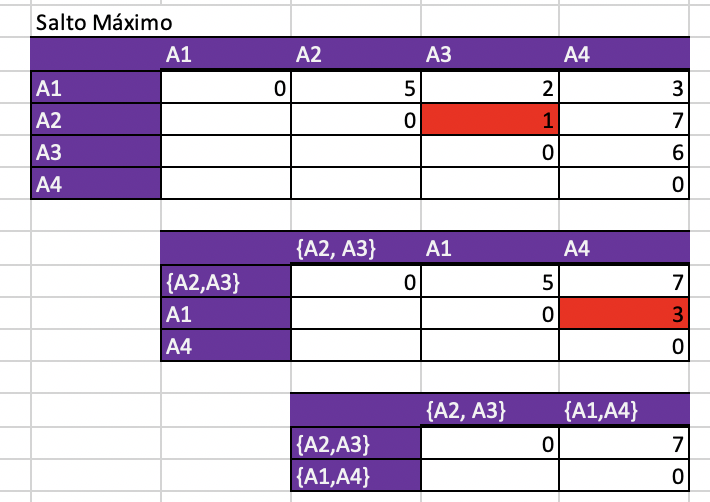
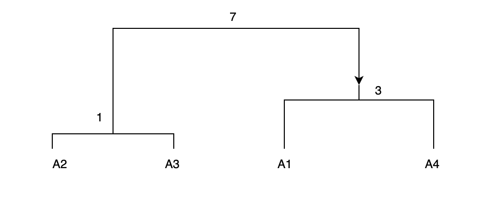
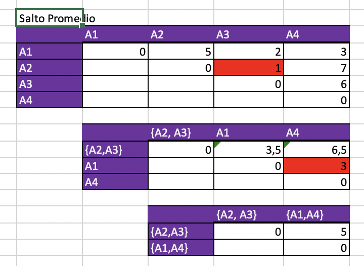
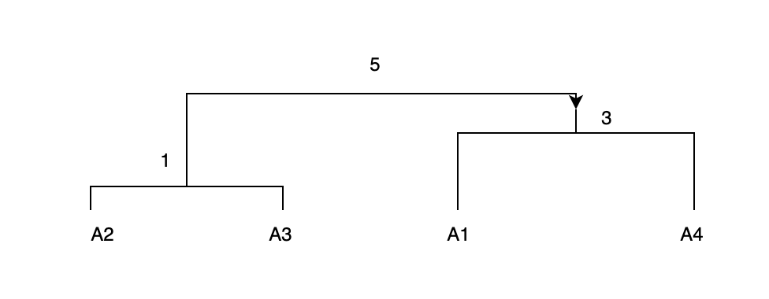

```{r setup, include=FALSE}
knitr::opts_chunk$set(echo = TRUE)
```

```{r}
library(knitr)
library(rmdformats)
library(ggplot2)
library(GGally)
library(factoextra)
library(FactoMineR)


knitr::opts_chunk$set(echo = TRUE)

options(max.print="75")

opts_chunk$set(echo=TRUE,
	             cache=FALSE,
               prompt=FALSE,
               tidy=TRUE,
               comment=NA,
               message=FALSE,
               warning=FALSE)
```


# Pregunta 1 {.tabset .tabset-fade}

En este ejerciciousaremos la tabla de datos EjemploAlgoritmosRecomendación.csv, la cual contiene los promedios de evaluación de 100 personas que adquirieron los mismos productos o muy similares en la tienda AMAZON. La idea consiste en recomendar a un cliente los productos que ha comprado otra persona que pertenece al mismo clúster.
\n 
```{r}
library(readr)

EjemploAlgoritmosRecomendacion <- read.table("DatosTarea/EjemploAlgoritmosRecomendacion.csv", sep = ";", dec = ",", row.names = 1, header = T)
```

## a) Ejecute un Clustering Jerárquico con la distancia euclídea y la agregación del Salto Máximo, Salto Mínimo, Promedio y Ward. Guarde la tabla de datos en el archivo AlgoritmosRecomendación2.csv con el clúster al que pertenece cada individuo para el caso de la agregación de Ward usando 2 clústeres. \n
```{r, fig.height= 3, fig.width=4}

#distancia euclidea 


#salto máximo
modelo <- hclust(dist(EjemploAlgoritmosRecomendacion, method = "euclidean"), method = "complete")

fviz_dend(modelo, cex = 1.3)


#salto mínimo 
modelo <- hclust(dist(EjemploAlgoritmosRecomendacion, method = "euclidean"), method = "single")

fviz_dend(modelo, cex = 1.3)

#salto promedio 

modelo <- hclust(dist(EjemploAlgoritmosRecomendacion, method = "euclidean"), method = "average")

fviz_dend(modelo, cex = 1.3)

#ward
modelo <- hclust(dist(EjemploAlgoritmosRecomendacion, method = "euclidean"), method = "ward.D2")

fviz_dend(modelo, cex = 1.3)


#tabla de datos
Grupos <- cutree(modelo, k = 2)

NDatos <- cbind(EjemploAlgoritmosRecomendacion, Grupos)

NDatos

#guardo el archivo
write.csv(NDatos,"AlgoritmosRecomendación2.csv")
```


## b) “Corte” el árbol anterior usando 2 clústeres y la agregación de Ward, interprete los resultados usando interpretación usando gráficos de barras (Horizontal-Vertical) y usando gráficos tipo Radar.
```{r, fig.width= 4, fig.height= 4}
library(cluster)
library(fmsb)

# Función para encontrar el centroide de cada cluster del profesor Oldemar
centroide <- function(num.cluster, datos, clusters) {
  ind <- (clusters == num.cluster)
  return(colMeans(datos[ind,]))
}

centro.cluster1 <-centroide(1,EjemploAlgoritmosRecomendacion,Grupos)

centro.cluster2 <-centroide(2,EjemploAlgoritmosRecomendacion,Grupos)

centros<-rbind(centro.cluster1,centro.cluster2)

colores <- c('#00429d', '#2e59a8', '#4771b2', '#5d8abd', '#73a2c6', '#8abccf', '#a5d5d8', '#c5eddf', '#ffffe0')

#gráfico de barras

barplot(t(centros),beside=TRUE,legend = colnames(centros), main = "Gráfico de interpretación de Clases", col=colores, cex.names = 0.65 , ylim = c(0,8))


```

En este gráfico de barras se observa que para el primer cluster, las personas dieron calificaciones altas en Durabilidad y Tamaño del Paquete; y callificaciones bajas en Velocidad de Entrega y Precio. \n
El segundo cluster, la personas valoraron más alto la tienda y dieron calificaciones altas en Durabilidad y Velocidad de Entrega en comparación al primer cluster, pero valoraron más bajo el Precio y Tamaño del Paquete.


```{r, fig.height= 4, fig.width= 4}
#gráfico tipo radar
centros<-as.data.frame(centros)
maximos<-apply(centros,2,max)
minimos<-apply(centros,2,min)
centros<-rbind(minimos,centros)
centros<-rbind(maximos,centros)

radarchart(as.data.frame(centros),maxmin=TRUE,axistype=4,axislabcol="slategray4",
             centerzero=FALSE,seg=7,
           cglcol="gray67",plty=1,plwd=2,title="Comparación de clústeres")

legend("bottom" ,legend=c("Cluster 1","Cluster 2"),
seg.len=-1.4,title="Clústeres",pch=21,bty="n" ,lwd=3, y.intersp=1, col = c("black","red"), xjust = 10, 
                horiz=FALSE)
```
En este gráfico el primer cluster se valoró alto el Tamaño del Paquete, Servicio de Retorno, Imagen del Producto y Precio. Se bajó puntos en Velocidad, Estrellas, Calidad, Valor Educativo y Durabilidad \n
Para el segundo Cluster, se valoró más la Velocidad de Entrega, Número de Estrellas, Calidad del Producto, Durabilidad y Valor Educativo, pero se rebajó en Servicio de Retorno, Precio, Imagen y Tamaño del Paquete

## c) Si se tienen 4 clústeres usando agregación de Ward ¿Qué productos recomendaría a Teresa, a Leo y a Justin?, es decir, ¿los productos que compra cúal otro cliente? Usando distancia euclídea ¿cuál es la mejor recomendación de compra que le podemos hacer a Teresa, a Leo y a Justin? 

```{r, fig.height= 3, fig.width= 4}
modelo <- hclust(dist(EjemploAlgoritmosRecomendacion, method = "euclidean"),method= "ward.D2")

plot(modelo)

rect.hclust(modelo, k = 4, border = "magenta")

```
Teresa está en el cluster 1, por lo que le podrían gustar los productos de Lydia. \n
Leo en el 2 podría compartir gustos con Jeremiah. \n
Justin en el 3 podría tener preferencias similares a las de Flora.

## d) Construya un clustering jerárquico sobre las componentes principales del ACP.

```{r, fig.width= 4, fig.height=4}
res  <- PCA(EjemploAlgoritmosRecomendacion, scale.unit=TRUE, ncp=5, graph = FALSE)
res.hcpc <- HCPC(res, nb.clust = -1, consol = TRUE, min = 3, max = 3, graph = FALSE)
plot.HCPC(res.hcpc, choice="bar")

plot.HCPC(res.hcpc, choice="map",select="cos2 0.1")
```
 
# Pregunta 2 {.tabset .tabset-fade}

La tabla de datos VotosCongresoUS.csv la cual contiene 16 votos (y=Sí, n=No, NS=No votó) dados por los congresistas de Estados Unidos respecto a 16 temáticas diferentes, además en la primera columna aparece el partido al que pertenecen (Republicano o Demócrata).

## a) Ejecute una clasificación jerárquica sobre esta tabla de datos usando la función daisy ya que los datos son cualitativos. Use métrica euclidean y método complete (deje el resultado en la variable jer). Cargue los datos con la siguiente instrucción:

Datos <- read.csv("VotosCongresoUS.csv",header=TRUE, sep=",", dec=".")

```{r}
library(cluster)

Datos <- read.csv("DatosTarea/VotosCongresoUS.csv",header=TRUE, sep=",", dec=".", stringsAsFactors = TRUE)

D <- daisy(Datos, metric = "euclidean")
jer <- hclust(D, method = "complete")
```


## b) Luego “corte” el árbol usando 3 clústeres y ejecute el siguiente código:

grupo<-cutree(jer, k = 3) \n
NDatos<-cbind(Datos,grupo) \n
\\ \\
cluster<-NDatos$grupo \n
sel.cluster1<-match(cluster,c(1),0) \n Datos.Cluster1<-NDatos[sel.cluster1>0,] \n 
dim(Datos.Cluster1) \n
\\ \\ 
sel.cluster2<-match(cluster,c(2),0) \n Datos.Cluster2<-NDatos[sel.cluster2>0,] \n
dim(Datos.Cluster2) \n
\\ \\
sel.cluster3<-match(cluster,c(3),0) \n Datos.Cluster3<-NDatos[sel.cluster3>0,] \n
dim(Datos.Cluster3)

```{r}
grupo<-cutree(jer, k = 3) #corta el arbol en 3 clusters
NDatos<-cbind(Datos,grupo) #crea una nueva tabla igual a la de Datos pero le agrega la columna del cluster al que corresponde

cluster<-NDatos$grupo # se extrae un vector con el cluster de cada fila 
sel.cluster1 <- match(cluster,1,0) #vector que tiene 1 en la posición donde había un 1 en cluster y 0 sino 
Datos.Cluster1 <-NDatos[sel.cluster1>0,] #Nueva tabla que toma solo las filas del cluster 1 según el índice del vector anterior 
dim(Datos.Cluster1) #dimensiones de la tabla anterior

sel.cluster2<-match(cluster,2,0) #vector que tiene 2 en la posición donde había un 2 en cluster y 0 sino 
Datos.Cluster2<-NDatos[sel.cluster2>0,] #Nueva tabla que toma solo las filas del cluster 2 según el índice del vector anterior  
dim(Datos.Cluster2) #dimensiones de la tabla anterior

sel.cluster3<-match(cluster,3,0) #vector que tiene 3 en la posición donde había un 2 en cluster y 0 sino 
Datos.Cluster3<-NDatos[sel.cluster3>0,] #Nueva tabla que toma solo las filas del cluster 3 según el índice del vector anterior  
dim(Datos.Cluster3) #dimensiones de la tabla anterior

```

Explique qué hace el código anterior. Luego ejecute el siguiente código: \n  
plot(Datos$Party,col=c(4,6),las=2,main="Party",xlab="Todos los Datos") \n
plot(Datos.Cluster1$Party,col=c(4,6),las=2,main="Party",xlab="Cluster-1") \n
plot(Datos.Cluster2$Party,col=c(4,6),las=2,main="Party",xlab="Cluster-2") \n
plot(Datos.Cluster3$Party,col=c(4,6),las=2,main="party",xlab="Cluster-3")
```{r}
plot(Datos$Party,col=c(4,6),las=2,main="Party",xlab="Todos los Datos")
plot(Datos.Cluster1$Party,col=c(4,6),las=2,main="Party",xlab="Cluster-1")
plot(Datos.Cluster2$Party,col=c(4,6),las=2,main="Party",xlab="Cluster-2")
plot(Datos.Cluster3$Party,col=c(4,6),las=2,main="party",xlab="Cluster-3")
```

Con ayuda de los gráficos anteriores y tomando en cuenta el tamaño de cada cluster interprete los 3 clústeres formados.\n 
\\ \\
En el primer cluster hay más republicanos casi que triplicando los demócratas. \n 
En el segundo cluster, están casi que todos los demócratas y 0 repúblicanos. \n
En el tercer cluster, hay menos personas (5) pero superadas en 1 por los republicanos.

# Pregunta 3
Realice un análisis similar al del ejercicio anterior con la tabla de datos CompraBicicletas.csv.
```{r}
Datos1 <- read.csv("DatosTarea/CompraBicicletas.csv",header=TRUE, sep=";", dec=".", stringsAsFactors = TRUE)

D1 <- daisy(Datos1, metric = "euclidean")
jer1 <- hclust(D1, method = "complete")
```

```{r}
grupo1<-cutree(jer1, k = 3) 
NDatos1<-cbind(Datos1,grupo1) 

cluster1<-NDatos1$grupo1 
sel.cluster1<-match(cluster1,c(1),0)
Datos.Cluster1<-NDatos1[sel.cluster1>0,]  
dim(Datos.Cluster1)

sel.cluster2<-match(cluster1,c(2),0)
Datos.Cluster2<-NDatos1[sel.cluster2>0,]
dim(Datos.Cluster2)

sel.cluster3<-match(cluster1,c(3),0)
Datos.Cluster3<-NDatos1[sel.cluster3>0,] 
dim(Datos.Cluster3)
```
```{r}
plot(Datos1$MaritalStatus,col=c(3,6),las=2,main="MaritalStatus",xlab="Todos los Datos")
plot(Datos.Cluster1$MaritalStatus,col=c(3,6),las=2,main="MaritalStatus",xlab="Cluster-1")
plot(Datos.Cluster2$MaritalStatus,col=c(3,6),las=2,main="MaritalStatus",xlab="Cluster-2")
plot(Datos.Cluster3$MaritalStatus,col=c(3,6),las=2,main="MaritalStatus",xlab="Cluster-3")
```
 
```{r,fig.height= 4, fig.width=4}
plot(Datos1$Education ,col=c(2,3,4,5,6),las=2,main="Education",xlab="Todos los Datos")
plot(Datos.Cluster1$Education,col=c(2,3,4,5,6),las=2,main="Education",xlab="Cluster-1")
plot(Datos.Cluster2$Education,col=c(2,3,4,5,6),las=2,main="Education",xlab="Cluster-2")
plot(Datos.Cluster3$Education,col=c(2,3,4,5,6),las=2,main="Education",xlab="Cluster-3")
```
 
# Pregunta 4
Dada la siguiente matriz de disimilitudes entre cuatro individuos A1, A2, A3 y A4, construya “a mano” una Jerarquía Binaria usando la agregación del Salto Máximo y del Promedio, dibuje el dendograma en ambos casos:

$$
\begin{pmatrix}
0 & & & \\
5 & 0 & & \\
2 & 1 & 0 & \\
3 & 7 & 6 & 0
\end{pmatrix}
$$
```{r}





```

Verifique los resultados con hclust.
```{r}
matriz <- matrix(c(0,5,2,3,5,0,1,7,2,1,0,6,3,7,6,0), nrow=4,ncol=4,"byrow"="true")

matriz

m <- as.data.frame(matriz)
maximo = hclust(dist(m),method = "complete")
plot(maximo)

avg = hclust(dist(m),method = "average")
plot(avg)
```

