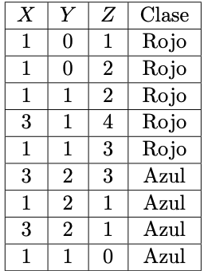

```{r setup, echo = FALSE}
library(knitr)
library(rmdformats)

## Global options
options(max.print="75")
opts_chunk$set(echo=TRUE,
               prompt=FALSE,
               tidy=TRUE,
               comment=NA,
               message=FALSE,
               warning=FALSE)
opts_knit$set(width=75)
```


# Pregunta 1 {.tabset .tabset-fade}

[30 puntos] En esta pregunta utiliza los datos (tumores.csv). Se trata de un conjunto de datos de características del tumor cerebral que incluye cinco variables de primer orden y ocho de textura y cuatro parámetros de evaluación de la calidad con el nivel objetivo. La variables son: Media, Varianza, Desviación estándar, Asimetría, Kurtosis, Contraste, Energía, ASM (segundo momento angular), Entropía, Homogeneidad, Disimilitud, Correlación, Grosor, PSNR (Pico de la relación señal-ruido), SSIM (Indice de Similitud Estructurada), MSE (Mean Square Error), DC (Coeficiente de Dados) y la variable a predecir tipo (1 = Tumor, 0 = No-Tumor). 

Realice lo siguiente:

## 1.
Cargue la tabla de datos tumores.csv en R y genere en R usando la función createDataPartition(...) del paquete caret la tabla de testing con una 25 % de los datos y con el resto de los datos genere una tabla de aprendizaje.

```{r}
library(caret)
library(readr)

tumores <- read.table("Datos Clase y Tareas/tumores.csv", sep = ",", dec = ".", header = TRUE, stringsAsFactors = TRUE)[-1]

tumores$tipo <- as.factor(ifelse(tumores$tipo ==1, "SI", "NO"))

p <- createDataPartition(tumores$tipo,p = 0.25, list = FALSE)

ttesting <- tumores[p,]
taprendizaje <- tumores[-p,]
```

## 2. 
Usando Máquinas de Soporte Vectorial, con todos los núcleos (kernel) (en traineR) genere un modelos predictivos para la tabla de aprendizaje.

```{r}
library(traineR)

modelo.linear <- train.svm(tipo~., data = taprendizaje, kernel = "linear")
prediccion.linear <- predict(modelo.linear, ttesting , type = "class")

modelo.polynomial <- train.svm(tipo~., data = taprendizaje, kernel = "polynomial")
prediccion.polynomial <- predict(modelo.polynomial, ttesting , type = "class")

modelo.radial <- train.svm(tipo~., data = taprendizaje, kernel = "radial")
prediccion.radial <- predict(modelo.radial, ttesting , type = "class")

modelo.sigmoid <- train.svm(tipo~., data = taprendizaje, kernel = "sigmoid")
prediccion.sigmoid <- predict(modelo.sigmoid, ttesting , type = "class")

```
 
## 3. {.tabset .tabset-fade}
Construya una tabla para los índices anteriores que permita comparar el resultado de Máquinas de Soporte Vectorial con respecto a los métodos generados en las tareas anteriores ¿Cúal método es mejor?

### Linear
```{r}
MC.Linear <- confusion.matrix(ttesting, prediccion.linear)
r1 <- general.indexes(mc = MC.Linear)
r1
```

### Polynomial

```{r}
MC.polynomial <- confusion.matrix(ttesting, prediccion.polynomial)
r2 <- general.indexes(mc = MC.polynomial)
r2
```

### Radial
```{r}
MC.radial <- confusion.matrix(ttesting, prediccion.radial)
r3 <- general.indexes(mc = MC.radial)
r3
```

### Sigmoid

```{r}
MC.sigmoid <- confusion.matrix(ttesting, prediccion.sigmoid)
r4 <- general.indexes(mc = MC.sigmoid)
r4
```

### Resultados

Cómo es un resultado variable, se programa una función que indique cual modelo tuvo mayor precisión global.

```{r}
#vector Con todas las Precisiones Globales de cada modelo
MC <- c(r1[2],r2[2],r3[2],r4[2])
names(MC) <- c("linear","polynomial","radial", "sigmoid")

MC[MC==max(unlist(MC))]
```

# Pregunta 2 {.tabset .tabset-fade}
Esta pregunta utiliza los datos sobre la conocida historia y trage- dia del Titanic, usando los datos titanicV2020.csv de los pasajeros se trata de predecir la supervivencia o no de un pasajero.

Realice lo siguiente:

## 1. 
Cargue la tabla de datos titanicV2020.csv, asegúrese recodificar las variables cualitativas y de ignorar variables que no se deben usar.

```{r}
titanic <- read.table("Datos Clase y Tareas/titanicV2020.csv", sep = ",", dec = ".", header = TRUE, stringsAsFactors = TRUE)

titanic <- titanic[,-c(1,4,9,11)]

titanic <- na.omit(titanic)

titanic$Survived <- as.factor(ifelse(titanic$Survived ==1, "SI", "NO"))
```

## 2. 
Usando el comando sample de R genere al azar una tabla aprendizaje con un 80% de los datos y con el resto de los datos genere una tabla de aprendizaje.
```{r}

n <- dim(titanic)[1]
muestra <- sample(1:n, floor(n*0.20))

ttesting <- titanic[muestra,]
taprendizaje <- titanic[-muestra,]
```

## 3. {.tabset .tabset-fade}

Genere un Modelo Predictivo usando SVM, con el paquete traineR, luego para este modelo calcule la matriz de confusión, la precisión, la precisión positiva, la precisión negativa, los falsos positivos, los falsos negativos, la acertividad positiva y la acertividad negativa. Utilice el Kernel que dé mejores resultados.

### Linear
```{r}
modelo.svm.linear <- train.svm(Survived~., data = taprendizaje, kernel = "linear")
prediccion.svm.linear <- predict(modelo.svm.linear, ttesting , type = "class")

mc.linear <- confusion.matrix(ttesting, prediccion.svm.linear)
r1 <- general.indexes(mc = mc.linear)
r1
```
### Polynomial
```{r}
modelo.svm.polynomial <- train.svm(Survived~., data = taprendizaje, kernel = "polynomial")
prediccion.svm.polynomial <- predict(modelo.svm.polynomial, ttesting , type = "class")

mc.polynomial <- confusion.matrix(ttesting, prediccion.svm.polynomial)
r2 <- general.indexes(mc = mc.polynomial)
r2
```
### Radial
```{r}
modelo.svm.radial <- train.svm(Survived~., data = taprendizaje, kernel = "radial")
prediccion.svm.radial <- predict(modelo.svm.radial, ttesting , type = "class")

mc.radial <- confusion.matrix(ttesting, prediccion.svm.radial)
r3 <- general.indexes(mc = mc.radial)
r3
```

### Sigmoid
```{r}
modelo.svm.sigmoid <- train.svm(Survived~., data = taprendizaje, kernel = "sigmoid")
prediccion.svm.sigmoid <- predict(modelo.svm.sigmoid, ttesting , type = "class")

mc.sigmoid <- confusion.matrix(ttesting, prediccion.svm.sigmoid)
r4 <- general.indexes(mc = mc.sigmoid)
r4
```

### Mejor Kernel

```{r}
mc <- c(r1[2],r2[2],r3[2],r4[2])
names(mc) <- c("linear","polynomial","radial", "sigmoid")

mc[mc==max(unlist(mc))]

# Índices para matrices NxN
indices.general <- function(MC) {
  precision.global <- sum(diag(MC))/sum(MC)
  error.global <- 1 - precision.global
  precision.categoria <- diag(MC)/rowSums(MC)
  falsos.positivos<- MC[1,2]/rowSums(MC)[1]
  falsos.negativos<- MC[2,1]/rowSums(MC)[2]
  asertividad.positiva<-MC[2,2]/ colSums(MC)[2]
  asertividas.negativa<-MC[1,1]/ colSums(MC)[1]
  
  res <- list(precision.global = precision.global, error.global = error.global, 
              precision.categoria = precision.categoria, falsos.positivos= falsos.positivos, falsos.negativos=falsos.negativos,
              asertividad.positiva=asertividad.positiva,asertividas.negativa=asertividas.negativa)
  names(res) <- c("Precisión Global", "Error Global", 
                  "Precisión por categoría","Falsos positivos","Falsos negativos","Asertividad Positiva", "Asertvidad Negativa")
  return(res)
}

```
La función parece indicar que el mejor método fue el polynomial, sin embargo tiene una precision global muy baja para poder considerarse un buen modelo de predicción.

## 4. 
Construya una tabla para los índices anteriores que permita comparar el resultado de los métodos SVM con respecto a los métodos de las tareas anteriores ¿Cuál método es mejor?

```{r}

modelo<-train.knn(Survived~.,data=taprendizaje)
prediccion <- predict(modelo, ttesting, type = "class")

MC <- confusion.matrix(ttesting, prediccion)
general.indexes(mc = MC)

indices.general(MC)
indices1 <- indices.general(mc.polynomial)
indices2 <- indices.general(MC)

indices2$`Precisión por categoría`<-sprintf("%f,%f", indices2$`Precisión por categoría`[1], indices2$`Precisión por categoría`[2])

indices1$`Precisión por categoría`<-sprintf("%f,%f", indices1$`Precisión por categoría`[1], indices1$`Precisión por categoría`[2])


tablaComparativa <-  rbind(as.data.frame(indices1),as.data.frame(indices2)) 

rownames(tablaComparativa) <- c("SVM", "KNN")

tablaComparativa
```

En general el método SVM tiene mejor precisión y más aciertos que el método KNN.

# Pregunta 3 {.tabset .tabset-fade}
En este ejercicio vamos a predecir números escritos a mano (Hand Written Digit Recognition), la tabla de de datos está en el archivo ZipData 2020.csv. En la figura siguiente se ilustran los datos:
```{r, fig.width=12, fig.height=8}
knitr::include_graphics("Captura de Pantalla 2020-10-02 a la(s) 13.54.31.png")
```

Para esto realice lo siguiente (podría tomar varios minutos los cálculos):

## 1. 
Cargue la tabla de datos ZipData 2020.csv en R.
```{r}
Datos <- read.table("Datos Clase y Tareas/ZipData_2020.csv", sep = ";", dec = ".", header = TRUE, stringsAsFactors = T)

Datos

```

## 2.

Use el método de Máquinas de Soporte Vectorial con el núcleo y los parámetros que usted considere más conveniente para generar un modelo predictivo para la tabla ZipData 2020.csv usando el 80 % de los datos para la tabla aprendizaje y un 20 % para la tabla testing, luego calcule para los datos de testing la matriz de confusión, la precisión global y la precisión para cada una de las categorías.
¿Son buenos los resultados? Explique.

```{r}

p <- createDataPartition(Datos$Numero, p = 0.20, list = FALSE)

testing <- Datos[p,]
aprendizaje <- Datos[-p,]

modelo <- train.svm(Numero~.,aprendizaje,kernel = "radial")
prediccion <- predict(modelo,testing,type = "class")

mc <- confusion.matrix(testing,prediccion)

general.indexes(mc=mc)
```
Utilizando radial como kernel, el modelo parece ser bastante bueno para todas las categorías.

## 3. 
Compare los resultados con los obtenidos en las tareas anteriores.

En la tarea anterior con el método knn el modelo obtenido era bastante acertado, sin embargo con este método hay una precisión global aún más alta.

# Pregunta 4 {.tabset .tabset-fade}
Suponga que se tiene la siguiente tabla de datos:
```{r}

```


## 1. 
Dibuje con colores los puntos de ambas clases en R.
```{r}
library(plotly)
Datos <- data.frame ( x = c(1 , 1 , 1 , 3 , 1 , 3 , 1 , 3 , 1) ,y = c(0 , 0 , 1 , 1 , 1 , 2 , 2 , 2 , 1) , z = c(1 , 2 , 2 , 4 , 3 , 3 , 1 , 1 , 0) ,clase = c(" Rojo ", " Rojo ", " Rojo "," Rojo ", " Rojo ", " Azul "," Azul ", " Azul ", " Azul ")) 
plot_ly(data = Datos) %>% add_trace ( x = ~x , y = ~y , z = ~z , color = ~clase , colors = c("#0C4B8E", "#BF382A") , mode = "markers", type = "scatter3d")
```

## 2. 
Dibuje el hiperplano  óptimo de separación e indique la ecuación de dicho hiperplano de la forma $ax + by + cz + d = 0$. Nota: Se debe observar con detenimiento los puntos de ambas clases para encontrar los vectores de soporte de cada margen y trazar con estos puntos los hiperplanos de los márgenes luego trazar el hiperplano de soporte justo en el centro.

```{r}
Datos2 <- data.frame ( x = c(1 , 1 , 3 ) ,y = c(0 , 1 , 1 ) , z = c(1 , 2 , 4 )) 
Datos3 <- data.frame ( x = c(1 , 1 , 3 ) ,y = c(1 , 2 , 2 ) , z = c(0 , 1 , 3 )) 
Datos4<-data.frame ( x = c(1 , 1 , 3 ) ,y = c(0.5 , 1.5 , 1.5 ) , z = c(0.5 , 1.5 , 3.5 ))

plot_ly(data = Datos) %>% add_trace ( x = ~x , y = ~y , z = ~z , color = ~clase , colors = c("#0C4B8E", "#BF382A") , mode = "markers", type = "scatter3d") %>% add_trace(data = Datos2, x = ~x , y = ~y , z = ~z ,  mode = 'lines', type = "scatter3d",showlegend=FALSE) %>% add_trace(data = Datos3, x = ~x , y = ~y , z = ~z ,  mode = 'lines', type = "scatter3d" ,   showlegend=FALSE) %>% add_trace(data = Datos4, x = ~x , y = ~y , z = ~z ,  mode = 'lines', type = "scatter3d" ,   showlegend=FALSE)
```

## 3.
Escriba la regla de clasificación para el clasificador con margen máximo. Debe ser algo como lo siguiente: $w = (w1,w2,w3)$ se clasifica como Rojo si $ax + by + cz + d > 0$ y otro caso se clasifica como Azul.


w = (w1, w2, w3) se clasifica como Rojo si 2x + 2y - 2z - 2 > 0, en cualquier otro caso seria azul

## 4.
Indique el margen para el hiperplano  óptimo y los vectores de soporte.

```{r}
library(pracma)
vector.cross <- function(a, b) {
    return (cross(a,b))
}

p<-c(1 , 0.5 , 0.5) 
q<- c(1 , 1.5 , 1.5 ) 
r<-c(3 , 1.5 , 3.5 )
pq<-q-p
pr<-r-p

vector.cross(pq, pr) 
#El margen para el hiperplano optimo es de 1.
#Los vectores de soporte serian:
vector1 <- cross(c(1 , 1 , 3 ) , c(0 , 1 , 1 ))
vector1
vector2 <- cross(c(1 , 2 , 2 )  , c(0 , 1 , 3 ))
vector2
```
## 5. 
Explique por qué un ligero movimiento de la octava observación no afectaría el hiperplano de margen máximo.

Ese punto no fue utilizado para sacar el hiperplano optimo por lo cual no afectaria.

## 6. 
Dibuje un hiperplano que no es el hiperplano óptimo de separación y proporcione la ecuación para este hiperplano.

```{r}
Datos4<-data.frame ( x = c(1 , 1 , 3 ) ,y = c(0 , 1 , 1 ) , z = c(0.5 , 1.5 , 3.5 )) 
plot_ly(data = Datos) %>% add_trace ( x = ~x , y = ~y , z = ~z , color = ~clase , colors = c("#0C4B8E", "#BF382A") , mode = "markers", type = "scatter3d") %>% add_trace(data = Datos2, x = ~x , y = ~y , z = ~z ,  mode = 'lines', type = "scatter3d",showlegend=FALSE) %>% add_trace(data = Datos3, x = ~x , y = ~y , z = ~z ,  mode = 'lines', type = "scatter3d" ,   showlegend=FALSE) %>% add_trace(data = Datos4, x = ~x , y = ~y , z = ~z ,  mode = 'lines', type = "scatter3d" ,   showlegend=FALSE) 

p<-c(1 , 0 , 0.5 )
q<- c(1, 1 , 1.5 ) 
r<-c(3 , 1 , 3.5 )
pq<-q-p
pr<-r-q

vector.cross(pq, pr) 
```

## 7. 
Dibuje un hiperplano de separación pero que no es el hiperplano  óptimo de separación, y escriba la ecuación correspondiente.
```{r}
Datos4<-data.frame ( x = c(0 , 0 , 2 ) ,y = c( 0.1, 1.1 , 1.1 ) , z = c(0.5 , 1.5 , 3.5 )) 
plot_ly(data = Datos) %>% add_trace ( x = ~x , y = ~y , z = ~z , color = ~clase , colors = c("#0C4B8E", "#BF382A") , mode = "markers", type = "scatter3d") %>% add_trace(data = Datos2, x = ~x , y = ~y , z = ~z ,  mode = 'lines', type = "scatter3d",showlegend=FALSE) %>% add_trace(data = Datos3, x = ~x , y = ~y , z = ~z ,  mode = 'lines', type = "scatter3d" ,   showlegend=FALSE) %>% add_trace(data = Datos4, x = ~x , y = ~y , z = ~z ,  mode = 'lines', type = "scatter3d" ,   showlegend=FALSE) 

p<-c(0 , 0.1 , 0.5 )
q<- c( 0, 1.1 , 1.5 ) 
r<-c(2 , 1.1 , 3.5 )
pq<-q-p
pr<-r-p
vector.cross(pq, pr)
```

## 8. 
Dibuje una observación adicional de manera que las dos clases ya no sean separables por un hiperplano.
```{r}
Datos <- data.frame ( x = c(1 , 1 , 1 , 3 , 1 , 3 , 1 , 3 , 1, 2) ,y = c(0 , 0 , 1 , 1 , 1 , 2 , 2 , 2 , 1, 4) , z = c(1 , 2 , 2 , 4 , 3 , 3 , 1 , 1 , 0, 2) ,clase = c(" Rojo ", " Rojo ", " Rojo "," Rojo ", " Rojo ", " Azul "," Azul ", " Azul ", " Azul "," Rojo ")) 
plot_ly(data = Datos) %>% add_trace ( x = ~x , y = ~y , z = ~z , color = ~clase , colors = c("#0C4B8E", "#BF382A") , mode = "markers", type = "scatter3d")

```

