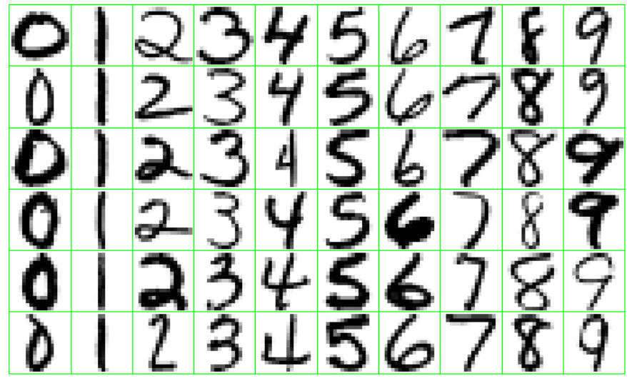
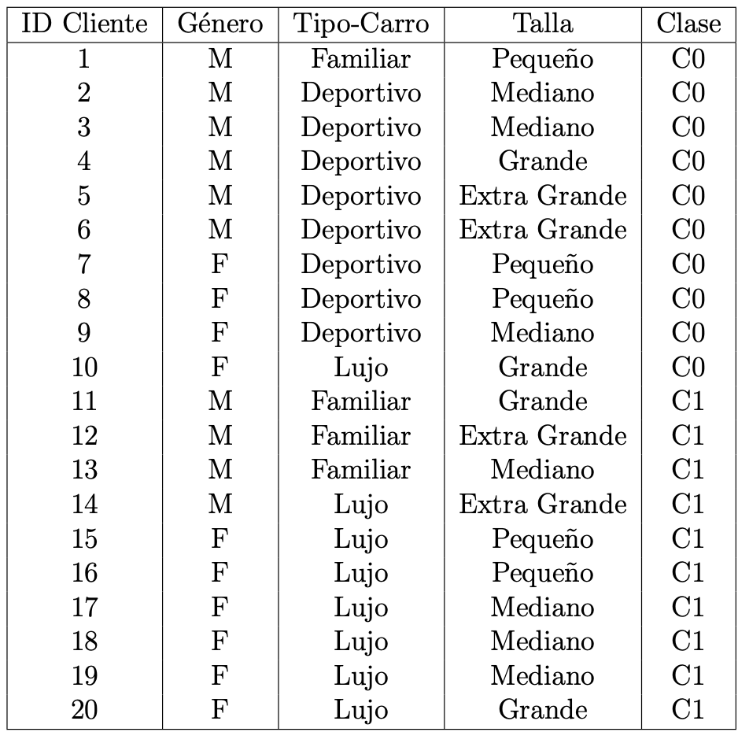

```{r setup, echo=FALSE}
library(knitr)
library(rmdformats)

## Global options
options(max.print="75")
opts_chunk$set(echo=TRUE,
               prompt=FALSE,
               tidy=TRUE,
               comment=NA,
               message=FALSE,
               warning=FALSE)
opts_knit$set(width=75)
```

# Pregunta 1 {.tabset .tabset-fade}
[30 puntos] En esta pregunta utiliza los datos (tumores.csv). Se trata de un conjunto de datos de características del tumor cerebral que incluye cinco variables de primer orden y ocho de textura y cuatro parámetros de evaluación de la calidad con el nivel objetivo. La variables son: Media, Varianza, Desviación estándar, Asimetría, Kurtosis, Contraste, Energía, ASM (segundo momento angular), Entropía, Homogeneidad, Disimilitud, Correlación, Grosor, PSNR (Pico de la relación señal-ruido),  SSIM (Indice de Similitud Estructurada), MSE (Mean Square Error), DC (Coeficiente de Dados) y la variable a predecir tipo (1 = Tumor, 0 = No-Tumor).
Realice lo siguiente:

## 1.
Cargue la tabla de datos tumores.csv en R y genere en R usando la función createDataPartition(...) del paquete caret la tabla de testing con una 25 % de los datos y con el resto de los datos genere una tabla de aprendizaje.

```{r}
library(readr)
library(caret)
library(traineR)
library(rpart)
library(rpart.plot)


tumores <- read.table("Datos Tarea/tumores.csv", sep = ",", dec = ".", header = TRUE)[,-1]

tumores$tipo <- as.factor(ifelse(tumores$tipo ==1, "SI", "NO"))

p <- createDataPartition(tumores$tipo, p = 0.25, list = FALSE)

ttesting <- tumores[p,]
taprendizaje <- tumores[-p,]
```

## 2. 
Usando árboles de Decisión (con traineR) genere un modelo predictivo para la tabla de aprendizaje. Modifique los parámetros del árbol de decisión para lograr los mejores resultados posibles. Grafique el árbol obtenido.

```{r}

modelo <- train.rpart(tipo~.,taprendizaje, minsplit=20, maxdepth = 4)

prediccion <- predict(modelo, ttesting, type = "class")

prp(modelo,extra=104,branch.type=2, box.col=c("pink", "palegreen3","cyan")[modelo$frame$yval])
```

## 3. {.tabset .tabset-fade}
Construya una tabla para los índices anteriores que permita comparar el resultado de los árboles de Decisión con respecto a los métodos generados en las tareas anteriores ¿Cúal método es mejor?

### Árboles de Decisión
```{r}
indices.general <- function(MC) {
  precision.global <- sum(diag(MC))/sum(MC)
  error.global <- 1 - precision.global
  precision.categoria <- diag(MC)/rowSums(MC)
  falsos.positivos<- MC[1,2]/rowSums(MC)[1]
  falsos.negativos<- MC[2,1]/rowSums(MC)[2]
  asertividad.positiva<-MC[2,2]/ colSums(MC)[2]
  asertividas.negativa<-MC[1,1]/ colSums(MC)[1]
  
  res <- list(precision.global = precision.global, error.global = error.global, 
              precision.categoria = precision.categoria, falsos.positivos= falsos.positivos, falsos.negativos=falsos.negativos,
              asertividad.positiva=asertividad.positiva,asertividas.negativa=asertividas.negativa)
  names(res) <- c("Precisión Global", "Error Global", 
                  "Precisión por categoría","Falsos positivos","Falsos negativos","Asertividad Positiva", "Asertvidad Negativa")
  return(res)
}

MC.AD <-  confusion.matrix(newdata = ttesting, prediccion)
MC.AD

```

### KNN
```{r}
#rectangular
modelo.rectangular <-train.knn(tipo~.,data=taprendizaje, kernel = "rectangular")
prediccion.rectangular <- predict(modelo.rectangular, ttesting, type = "class")

MC.rectangular <- confusion.matrix(ttesting, prediccion.rectangular)

#triangular
modelo.triangular <- train.knn(tipo~., data = taprendizaje, kernel = "triangular")

prediccion.triangular <- predict(modelo.triangular, ttesting, type = "class")

MC.triangular<- confusion.matrix(ttesting ,prediccion.triangular)

#epanechnikov
modelo.epanechnikov <- train.knn(tipo~., data = taprendizaje, kernel = "epanechnikov")

prediccion.epanechnikov <- predict(modelo.epanechnikov, ttesting, type = "class")

MC.epanechnikov<- confusion.matrix(ttesting ,prediccion.epanechnikov)

#biweight
modelo.biweight <- train.knn(tipo~., data = taprendizaje, kernel = "biweight")

prediccion.biweight <- predict(modelo.biweight, ttesting, type = "class")

MC.biweight<- confusion.matrix(ttesting ,prediccion.biweight)

#triweight
modelo.triweight <- train.knn(tipo~., data = taprendizaje, kernel = "triweight")

prediccion.triweight <- predict(modelo.triweight, ttesting, type = "class")

MC.triweight<- confusion.matrix(ttesting ,prediccion.triweight)

#cos
modelo.cos <- train.knn(tipo~., data = taprendizaje, kernel = "cos")

prediccion.cos <- predict(modelo.cos, ttesting, type = "class")

MC.cos<- confusion.matrix(ttesting,prediccion.cos)

#inv
modelo.inv <- train.knn(tipo~., data = taprendizaje, kernel = "inv")

prediccion.inv <- predict(modelo.inv, ttesting, type = "class")

MC.inv<- confusion.matrix(ttesting ,prediccion.inv)

#optimal
modelo.optimal <- train.knn(tipo~., data = taprendizaje, kernel = "optimal")

prediccion.optimal <- predict(modelo.optimal, ttesting, type = "class")

MC.optimal<- confusion.matrix(ttesting ,prediccion.optimal)


```

### SVM

```{r}
#linear
modelo.linear <- train.svm(tipo~., data = taprendizaje, kernel = "linear")
prediccion.linear <- predict(modelo.linear, ttesting , type = "class")
MC.Linear <- confusion.matrix(ttesting, prediccion.linear)

#polynomial
modelo.polynomial <- train.svm(tipo~., data = taprendizaje, kernel = "polynomial")
prediccion.polynomial <- predict(modelo.polynomial, ttesting , type = "class")
MC.polynomial <- confusion.matrix(ttesting, prediccion.polynomial)

#radial
modelo.radial <- train.svm(tipo~., data = taprendizaje, kernel = "radial")
prediccion.radial <- predict(modelo.radial, ttesting , type = "class")
MC.radial <- confusion.matrix(ttesting, prediccion.radial)

#sigmoid
modelo.sigmoid <- train.svm(tipo~., data = taprendizaje, kernel = "sigmoid")
prediccion.sigmoid <- predict(modelo.sigmoid, ttesting , type = "class")
MC.sigmoid <- confusion.matrix(ttesting, prediccion.sigmoid)
```

### Tabla Comparativa

```{r}
library(dplyr)


indices1 <- indices.general(MC.AD)
indices2 <- indices.general(MC.rectangular)
indices3 <- indices.general(MC.triangular)
indices4 <- indices.general(MC.epanechnikov)
indices5 <- indices.general(MC.biweight)
indices6 <- indices.general(MC.triweight)
indices7 <- indices.general(MC.cos)
indices8 <- indices.general(MC.inv)

indices9 <- indices.general(MC.Linear)
indices10 <- indices.general(MC.polynomial)
indices11 <- indices.general(MC.radial)
indices12 <- indices.general(MC.sigmoid)


indices1$`Precisión por categoría`<-sprintf("%f,%f", indices1$`Precisión por categoría`[1], indices1$`Precisión por categoría`[2])

indices2$`Precisión por categoría`<-sprintf("%f,%f", indices2$`Precisión por categoría`[1], indices2$`Precisión por categoría`[2])

indices3$`Precisión por categoría`<-sprintf("%f,%f", indices3$`Precisión por categoría`[1], indices3$`Precisión por categoría`[2])

indices4$`Precisión por categoría`<-sprintf("%f,%f", indices4$`Precisión por categoría`[1], indices4$`Precisión por categoría`[2])

indices5$`Precisión por categoría`<-sprintf("%f,%f", indices5$`Precisión por categoría`[1], indices5$`Precisión por categoría`[2])

indices6$`Precisión por categoría`<-sprintf("%f,%f", indices6$`Precisión por categoría`[1], indices6$`Precisión por categoría`[2])

indices7$`Precisión por categoría`<-sprintf("%f,%f", indices7$`Precisión por categoría`[1], indices7$`Precisión por categoría`[2])

indices8$`Precisión por categoría`<-sprintf("%f,%f", indices8$`Precisión por categoría`[1], indices8$`Precisión por categoría`[2])

indices9$`Precisión por categoría`<-sprintf("%f,%f", indices9$`Precisión por categoría`[1], indices9$`Precisión por categoría`[2])

indices10$`Precisión por categoría`<-sprintf("%f,%f", indices10$`Precisión por categoría`[1], indices10$`Precisión por categoría`[2])

indices11$`Precisión por categoría`<-sprintf("%f,%f", indices11$`Precisión por categoría`[1], indices11$`Precisión por categoría`[2])

indices12$`Precisión por categoría`<-sprintf("%f,%f", indices12$`Precisión por categoría`[1], indices12$`Precisión por categoría`[2])


tablaComparativa <-  rbind(as.data.frame(indices1),as.data.frame(indices2),as.data.frame(indices3),as.data.frame(indices4),as.data.frame(indices5),as.data.frame(indices6),as.data.frame(indices7),as.data.frame(indices8),as.data.frame(indices9),as.data.frame(indices10),as.data.frame(indices11),as.data.frame(indices12)) 

rownames(tablaComparativa) <- c("arboles decision","rectangular", "triangular", "epanechnikov", "biweight", "triweight", "cos", "inv","linear","polynomial","radial", "sigmoid")

tablaComparativa

#Mejor Método basados en su Precisión Global
tablaComparativa%>%
  filter(Precisión.Global ==  max(Precisión.Global))

write.csv(tablaComparativa,"Tabla Comparativa tumores.csv", row.names = FALSE)

```
Seleccionando el método con mayor Precisión Global Arboles de Decisión sería el de mejor resultados.

# Pregunta 2 {.tabset .tabset-fade}
[30 puntos] Esta pregunta utiliza los datos sobre la conocida historia y tragedia del Titanic, usando los datos titanicV2020.csv de los pasajeros se trata de predecir la supervivencia o no de un pasajero.
Realice lo siguiente:

## 1. 
Cargue la tabla de datos titanicV2020.csv, asegúrese de recodificar las variables cualitativas y de ignorar variables que no se deben usar.

```{r}
titanic <- read.table("Datos Tarea/titanicV2020.csv", sep = ",", dec = ".", header = TRUE, stringsAsFactors = TRUE)

titanic <- titanic[,-c(1,4,9,11)]

titanic <- na.omit(titanic)

titanic$Survived <- as.factor(ifelse(titanic$Survived == 1, "SI", "NO"))
```

## 2. 
Usando el comando sample de R genere al azar una tabla aprendizaje con un 80 % de los datos y con el resto de los datos genere una tabla de aprendizaje.

```{r}
n <- dim(titanic)[1]

muestra <- sample(1:n,floor(0.80*n))

ttesting <- titanic[-muestra,]
taprendizaje <- titanic[muestra,]
```

## 3. 
Usando  árboles de Decisión (con traineR) genere un modelo predictivo para la tabla de aprendizaje. Modifique los parámetros del árbol de decisión para lograr los mejores resultados posibles. Grafique el  árbol obtenido.

```{r}
modelo <- train.rpart(Survived~., data = taprendizaje,minsplit=20, maxdepth = 4)

prediccion <- predict(modelo,ttesting,type = "class")
MC.AD <- confusion.matrix(ttesting,prediccion)

indices.general(MC.AD)

prp(modelo,
    extra=104,
    branch.type=2, 
    box.col=c("pink",
              "palegreen3",
              "cyan")[modelo$frame$yval])
```

## 4. {.tabset .tabset-fade}
Construya una tabla para los  índices anteriores que permita comparar el resultado de los árboles de Decisión con respecto a los métodos generados en las tareas anteriores ¿Cúal método es mejor?

### KNN
```{r}
#rectangular
modelo.rectangular <-train.knn(Survived~.,data=taprendizaje, kernel = "rectangular")
prediccion.rectangular <- predict(modelo.rectangular, ttesting, type = "class")

MC.rectangular <- confusion.matrix(ttesting, prediccion.rectangular)

#triangular
modelo.triangular <- train.knn(Survived~., data = taprendizaje, kernel = "triangular")

prediccion.triangular <- predict(modelo.triangular, ttesting, type = "class")

MC.triangular<- confusion.matrix(ttesting ,prediccion.triangular)

#epanechnikov
modelo.epanechnikov <- train.knn(Survived~., data = taprendizaje, kernel = "epanechnikov")

prediccion.epanechnikov <- predict(modelo.epanechnikov, ttesting, type = "class")

MC.epanechnikov<- confusion.matrix(ttesting ,prediccion.epanechnikov)

#biweight
modelo.biweight <- train.knn(Survived~., data = taprendizaje, kernel = "biweight")

prediccion.biweight <- predict(modelo.biweight, ttesting, type = "class")

MC.biweight<- confusion.matrix(ttesting ,prediccion.biweight)

#triweight
modelo.triweight <- train.knn(Survived~., data = taprendizaje, kernel = "triweight")

prediccion.triweight <- predict(modelo.triweight, ttesting, type = "class")

MC.triweight<- confusion.matrix(ttesting ,prediccion.triweight)

#cos
modelo.cos <- train.knn(Survived~., data = taprendizaje, kernel = "cos")

prediccion.cos <- predict(modelo.cos, ttesting, type = "class")

MC.cos<- confusion.matrix(ttesting,prediccion.cos)

#inv
modelo.inv <- train.knn(Survived~., data = taprendizaje, kernel = "inv")

prediccion.inv <- predict(modelo.inv, ttesting, type = "class")

MC.inv<- confusion.matrix(ttesting ,prediccion.inv)

#optimal
modelo.optimal <- train.knn(Survived~., data = taprendizaje, kernel = "optimal")

prediccion.optimal <- predict(modelo.optimal, ttesting, type = "class")

MC.optimal<- confusion.matrix(ttesting ,prediccion.optimal)


```

### SVM

```{r}
#linear
modelo.linear <- train.svm(Survived~., data = taprendizaje, kernel = "linear")
prediccion.linear <- predict(modelo.linear, ttesting , type = "class")
MC.Linear <- confusion.matrix(ttesting, prediccion.linear)

#polynomial
modelo.polynomial <- train.svm(Survived~., data = taprendizaje, kernel = "polynomial")
prediccion.polynomial <- predict(modelo.polynomial, ttesting , type = "class")
MC.polynomial <- confusion.matrix(ttesting, prediccion.polynomial)

#radial
modelo.radial <- train.svm(Survived~., data = taprendizaje, kernel = "radial")
prediccion.radial <- predict(modelo.radial, ttesting , type = "class")
MC.radial <- confusion.matrix(ttesting, prediccion.radial)

#sigmoid
modelo.sigmoid <- train.svm(Survived~., data = taprendizaje, kernel = "sigmoid")
prediccion.sigmoid <- predict(modelo.sigmoid, ttesting , type = "class")
MC.sigmoid <- confusion.matrix(ttesting, prediccion.sigmoid)
```

### Tabla Comparativa

```{r}

library(dplyr)


indices1 <- indices.general(MC.AD)
indices2 <- indices.general(MC.rectangular)
indices3 <- indices.general(MC.triangular)
indices4 <- indices.general(MC.epanechnikov)
indices5 <- indices.general(MC.biweight)
indices6 <- indices.general(MC.triweight)
indices7 <- indices.general(MC.cos)
indices8 <- indices.general(MC.inv)

indices9 <- indices.general(MC.Linear)
indices10 <- indices.general(MC.polynomial)
indices11 <- indices.general(MC.radial)
indices12 <- indices.general(MC.sigmoid)


indices1$`Precisión por categoría`<-sprintf("%f,%f", indices1$`Precisión por categoría`[1], indices1$`Precisión por categoría`[2])

indices2$`Precisión por categoría`<-sprintf("%f,%f", indices2$`Precisión por categoría`[1], indices2$`Precisión por categoría`[2])

indices3$`Precisión por categoría`<-sprintf("%f,%f", indices3$`Precisión por categoría`[1], indices3$`Precisión por categoría`[2])

indices4$`Precisión por categoría`<-sprintf("%f,%f", indices4$`Precisión por categoría`[1], indices4$`Precisión por categoría`[2])

indices5$`Precisión por categoría`<-sprintf("%f,%f", indices5$`Precisión por categoría`[1], indices5$`Precisión por categoría`[2])

indices6$`Precisión por categoría`<-sprintf("%f,%f", indices6$`Precisión por categoría`[1], indices6$`Precisión por categoría`[2])

indices7$`Precisión por categoría`<-sprintf("%f,%f", indices7$`Precisión por categoría`[1], indices7$`Precisión por categoría`[2])

indices8$`Precisión por categoría`<-sprintf("%f,%f", indices8$`Precisión por categoría`[1], indices8$`Precisión por categoría`[2])

indices9$`Precisión por categoría`<-sprintf("%f,%f", indices9$`Precisión por categoría`[1], indices9$`Precisión por categoría`[2])

indices10$`Precisión por categoría`<-sprintf("%f,%f", indices10$`Precisión por categoría`[1], indices10$`Precisión por categoría`[2])

indices11$`Precisión por categoría`<-sprintf("%f,%f", indices11$`Precisión por categoría`[1], indices11$`Precisión por categoría`[2])

indices12$`Precisión por categoría`<-sprintf("%f,%f", indices12$`Precisión por categoría`[1], indices12$`Precisión por categoría`[2])


tablaComparativa <-  rbind(as.data.frame(indices1),as.data.frame(indices2),as.data.frame(indices3),as.data.frame(indices4),as.data.frame(indices5),as.data.frame(indices6),as.data.frame(indices7),as.data.frame(indices8),as.data.frame(indices9),as.data.frame(indices10),as.data.frame(indices11),as.data.frame(indices12)) 

rownames(tablaComparativa) <- c("arboles decision","rectangular", "triangular", "epanechnikov", "biweight", "triweight", "cos", "inv","linear","polynomial","radial", "sigmoid")

tablaComparativa

#Mejor Método basado en su Precisión Global
tablaComparativa%>%
  filter(Precisión.Global ==  max(Precisión.Global))

write.csv(tablaComparativa,"Tabla Comparativa titanic.csv", row.names = FALSE)

```

# Pregunta 3 {.tabset .tabset-fade} 
[30 puntos] En este ejercicio vamos a predecir números escritos a mano (Hand Written Digit Recognition), la tabla de de datos está en el archivo ZipData 2020.csv. En la figura siguiente se ilustran los datos:

```{r, fig.width=12, fig.height=8}

```

Para esto realice lo siguiente (podría tomar varios minutos los cálculos):

## 1. 
Cargue la tabla de datos ZipData 2020.csv en R.

```{r}
Datos <- read.table("Datos Tarea/ZipData_2020.csv", sep = ";", dec = ".", header = TRUE, stringsAsFactors = T)

Datos

n <- dim(Datos)[1]
p <- sample(1:n,floor(n*0.80))

ttesting <- Datos[-p,]
taprendizaje <- Datos[p,]
```

## 2.
Use el método de Arboles de Decisión con el método y los parámetros que usted considere más convenientes para generar un modelo predictivo para la tabla ZipData 2020.csv usando el 80% de los datos para la tabla aprendizaje y un 20% para la tabla testing, luego calcule para los datos de testing la matriz de confusión, la precisión global y la precisión para cada una de las categorías. ¿Son buenos los resultados? Explique.

```{r}


modelo <- train.rpart(Numero~.,data = taprendizaje,minsplit=5, maxdepth = 4)
prp(modelo,extra=104,
    branch.type=2, 
    box.col=c("pink",
              "palegreen3",
              "cyan",
              "red",
              "blue",
              "yellow",
              "purple",
              "orange",
              "brown")[modelo$frame$yval])
```


## 3. {.tabset .tabset-fade}
Compare los resultados con los obtenidos en las tareas anteriores.

### Árboles de Decisión

```{r cache = TRUE}
prediccion <- predict(modelo, ttesting,type = "class")
MC.AD <- confusion.matrix(ttesting,prediccion)
```


### KNN
```{r cache=TRUE}
#rectangular
modelo.rectangular <-train.knn(Numero~.,data=taprendizaje, kernel = "rectangular")
prediccion.rectangular <- predict(modelo.rectangular, ttesting, type = "class")

MC.rectangular <- confusion.matrix(ttesting, prediccion.rectangular)

#triangular
modelo.triangular <- train.knn(Numero~., data = taprendizaje, kernel = "triangular")

prediccion.triangular <- predict(modelo.triangular, ttesting, type = "class")

MC.triangular<- confusion.matrix(ttesting ,prediccion.triangular)

#epanechnikov
modelo.epanechnikov <- train.knn(Numero~., data = taprendizaje, kernel = "epanechnikov")

prediccion.epanechnikov <- predict(modelo.epanechnikov, ttesting, type = "class")

MC.epanechnikov<- confusion.matrix(ttesting ,prediccion.epanechnikov)

#biweight
modelo.biweight <- train.knn(Numero~., data = taprendizaje, kernel = "biweight")

prediccion.biweight <- predict(modelo.biweight, ttesting, type = "class")

MC.biweight<- confusion.matrix(ttesting ,prediccion.biweight)

#triweight
modelo.triweight <- train.knn(Numero~., data = taprendizaje, kernel = "triweight")

prediccion.triweight <- predict(modelo.triweight, ttesting, type = "class")

MC.triweight<- confusion.matrix(ttesting ,prediccion.triweight)

#cos
modelo.cos <- train.knn(Numero~., data = taprendizaje, kernel = "cos")

prediccion.cos <- predict(modelo.cos, ttesting, type = "class")

MC.cos<- confusion.matrix(ttesting,prediccion.cos)

#inv
modelo.inv <- train.knn(Numero~., data = taprendizaje, kernel = "inv")

prediccion.inv <- predict(modelo.inv, ttesting, type = "class")

MC.inv<- confusion.matrix(ttesting ,prediccion.inv)

#optimal
modelo.optimal <- train.knn(Numero~., data = taprendizaje, kernel = "optimal")

prediccion.optimal <- predict(modelo.optimal, ttesting, type = "class")

MC.optimal<- confusion.matrix(ttesting ,prediccion.optimal)


```

### SVM

```{r cache=TRUE}
#linear
modelo.linear <- train.svm(Numero~., data = taprendizaje, kernel = "linear")
prediccion.linear <- predict(modelo.linear, ttesting , type = "class")
MC.Linear <- confusion.matrix(ttesting, prediccion.linear)

#polynomial
modelo.polynomial <- train.svm(Numero~., data = taprendizaje, kernel = "polynomial")
prediccion.polynomial <- predict(modelo.polynomial, ttesting , type = "class")
MC.polynomial <- confusion.matrix(ttesting, prediccion.polynomial)

#radial
modelo.radial <- train.svm(Numero~., data = taprendizaje, kernel = "radial")
prediccion.radial <- predict(modelo.radial, ttesting , type = "class")
MC.radial <- confusion.matrix(ttesting, prediccion.radial)

#sigmoid
modelo.sigmoid <- train.svm(Numero~., data = taprendizaje, kernel = "sigmoid")
prediccion.sigmoid <- predict(modelo.sigmoid, ttesting , type = "class")
MC.sigmoid <- confusion.matrix(ttesting, prediccion.sigmoid)
```

### Tabla Comparativa

```{r}

library(dplyr)


indices1 <- indices.general(MC.AD)
indices2 <- indices.general(MC.rectangular)
indices3 <- indices.general(MC.triangular)
indices4 <- indices.general(MC.epanechnikov)
indices5 <- indices.general(MC.biweight)
indices6 <- indices.general(MC.triweight)
indices7 <- indices.general(MC.cos)
indices8 <- indices.general(MC.inv)

indices9 <- indices.general(MC.Linear)
indices10 <- indices.general(MC.polynomial)
indices11 <- indices.general(MC.radial)
indices12 <- indices.general(MC.sigmoid)


indices1$`Precisión por categoría`<-sprintf("%f,%f", indices1$`Precisión por categoría`[1], indices1$`Precisión por categoría`[2])

indices2$`Precisión por categoría`<-sprintf("%f,%f", indices2$`Precisión por categoría`[1], indices2$`Precisión por categoría`[2])

indices3$`Precisión por categoría`<-sprintf("%f,%f", indices3$`Precisión por categoría`[1], indices3$`Precisión por categoría`[2])

indices4$`Precisión por categoría`<-sprintf("%f,%f", indices4$`Precisión por categoría`[1], indices4$`Precisión por categoría`[2])

indices5$`Precisión por categoría`<-sprintf("%f,%f", indices5$`Precisión por categoría`[1], indices5$`Precisión por categoría`[2])

indices6$`Precisión por categoría`<-sprintf("%f,%f", indices6$`Precisión por categoría`[1], indices6$`Precisión por categoría`[2])

indices7$`Precisión por categoría`<-sprintf("%f,%f", indices7$`Precisión por categoría`[1], indices7$`Precisión por categoría`[2])

indices8$`Precisión por categoría`<-sprintf("%f,%f", indices8$`Precisión por categoría`[1], indices8$`Precisión por categoría`[2])

indices9$`Precisión por categoría`<-sprintf("%f,%f", indices9$`Precisión por categoría`[1], indices9$`Precisión por categoría`[2])

indices10$`Precisión por categoría`<-sprintf("%f,%f", indices10$`Precisión por categoría`[1], indices10$`Precisión por categoría`[2])

indices11$`Precisión por categoría`<-sprintf("%f,%f", indices11$`Precisión por categoría`[1], indices11$`Precisión por categoría`[2])

indices12$`Precisión por categoría`<-sprintf("%f,%f", indices12$`Precisión por categoría`[1], indices12$`Precisión por categoría`[2])


tablaComparativa <-  rbind(as.data.frame(indices1),as.data.frame(indices2),as.data.frame(indices3),as.data.frame(indices4),as.data.frame(indices5),as.data.frame(indices6),as.data.frame(indices7),as.data.frame(indices8),as.data.frame(indices9),as.data.frame(indices10),as.data.frame(indices11),as.data.frame(indices12)) 

rownames(tablaComparativa) <- c("arboles decision","rectangular", "triangular", "epanechnikov", "biweight", "triweight", "cos", "inv","linear","polynomial","radial", "sigmoid")

tablaComparativa

#Mejor Método basado en su Precisión Global
tablaComparativa%>%
  filter(Precisión.Global ==  max(Precisión.Global))

write.csv(tablaComparativa,"Tabla Comparativa ZipData.csv", row.names = FALSE)
```

# Pregunta 4 {.tabset .tabset-fade}
[10 puntos] [no usar rpart ni traineR] Considere los datos de entrenamiento que se muestran en la siguiente Tabla para un problema de clasificación binaria.

```{r}


```
```{r}
#Datos en dataframe
ID <- 1:20
Genero <- c("M","M","M","M","M","M","F","F","F","F","M","M","M","M","F","F","F","F","F","F")
TipoCarro <- c("Familiar", "Deportivo", "Deportivo","Deportivo", "Deportivo","Deportivo", "Deportivo","Deportivo", "Deportivo","Lujo", "Familiar","Familiar","Familiar","Lujo","Lujo","Lujo","Lujo","Lujo","Lujo","Lujo")
Talla <- c("Pequeno", "Mediano","Mediano","Grande","Extra Grande", "Extra Grande", "Pequeno","Pequeno","Mediano","Grande","Grande","Extra Grande","Mediano","Extra Grande","Pequeno","Pequeno","Mediano","Mediano","Mediano", "Grande")
Clase <- c("C0","C0","C0","C0","C0","C0","C0","C0","C0","C0","C1","C1","C1","C1","C1","C1","C1","C1","C1","C1")

Datos <- data.frame(ID,Genero,TipoCarro,Talla,Clase)
Datos
```

## 1. 
Calcule el índice de Gini para la tabla completa.
```{r}
indiceGini <- 1- (10/20)^2 - (10/20)^2
indiceGini
```

## 2. 
Calcule el  índice de Gini para la variable Género.
```{r}
Datos%>%
  group_by(Clase)%>%
  count(Genero)

giniFem <- 1- (4/10)^2 - (6/10)^2
giniFem
giniMasc <- 1- (4/10)^2 - (6/10)^2
giniMasc
giniSlipGenero <- (10/20)*giniFem + (10/20)*giniMasc
giniSlipGenero
```

## 3. 
Calcule el  índice de Gini para la variable Tipo-Carro.
```{r}
Datos%>%
  group_by(Clase)%>%
  count(TipoCarro)

giniDeportivo <- 1-(8/8)^2-(0/8)^2
giniDeportivo

giniFamiliar <- 1 - (1/4)^2 - (3/4)^2
giniFamiliar

giniLujoDeport <- 1 - (9/16)^2 - (7/16)^2
giniLujoDeport

#Se usa la combinación Lujo/deporti y Familiar
giniSlipTipoCarro <- (4/20)*giniFamiliar + (16/20)*giniLujoDeport
giniSlipTipoCarro
```

## 4. 
Calcule el  índice de Gini para la variable Talla. 
```{r}
Datos%>%
  group_by(Clase)%>%
  count(Talla)

giniExtraGrande <- 1- (2/4)^2 - (2/4)^2
giniExtraGrande

giniGrande <- 1- ((2+2)/(4+4))^2 - ((2+2)/(4+4))^2
giniGrande

giniMediano <- 1- (3/7)^2 - (4/7)^2
giniMediano

giniPequeno <- 1 - ((3+3)/(5+7))^2 - ((2+4)/(5+7))^2
giniPequeno

# Se usa la combinación ExtraGra/Grande y Mediano/Pequeñ
giniSlipTalla <-  ((4+4)/20)*giniGrande  + ((5+7)/20)*giniPequeno
giniSlipTalla

```

## 5. 
¿Cuál variable es mejor, Género, Tipo-Carro o Talla?

```{r}
Ginis <- c(giniSlipGenero,giniSlipTipoCarro,giniSlipTalla)

names(Ginis) <- c("Genero","Tipo Carro", "Talla")

Ginis[Ginis == min(Ginis)]
```


## 6. 
Explique por qué el ID Cliente no se debe usar como variable aunque tenga el Gini más bajo.

Por que no es una variable que aporte información valiosa, también podría decirse que no es ni siquiera una variable sino más bien identificadores.